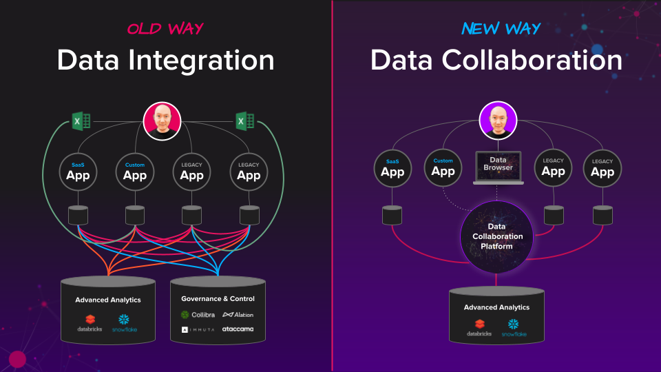

# Data Collaboration Overview

**You are currently browsing the Cinchy v5.8 platform documentation.** For documentation about other versions of the platform, please navigate to the relevant space(s) via the drop-down menu in the upper left of the page.

## What’s the purpose of Data Collaboration?

Data collaboration aims to facilitate the sharing, management, and utilization of data across various departments, teams, and systems within an organization. This approach aims to eliminate data silos and reduce the inefficiencies associated with traditional data integration methods like ETL processes or APIs. Data collaboration enables multiple stakeholders to co-produce and maintain data in a controlled, federated manner. Doing so enhances data quality, speeds decision-making, and allows more agile and scalable business operations. Data collaboration aims to maximize the business value derived from data while minimizing the costs and complexities traditionally associated with data management.

<figure><figcaption>
Image 1: Collaboration vs. Integration
</figcaption></figure>

## The root causes of IT delay and frustration.

When a new IT project is green-lit, you often pay a hefty fine called the **integration tax,** where you're continuously building new integrations between applications just to reuse data that's already available in your systems.

Over time, this never-ending cycle of copying data between fragmented apps gets more complex, resulting in delayed launches, budget overruns, and “shadow IT” projects.

Facing the rising costs and complexities of traditional data integration? You're not alone. At Cinchy, we understand that the 'Integration Tax' is a growing burden for modern organizations. As your enterprise expands its technology stack, the maze of required integrations becomes exponentially more intricate and expensive to manage. It's not just about initial setup; maintenance, updates, and reconfigurations add up, consuming a large portion of your IT budget and holding back your agility.

### **“Every year, as the level of new technologies and digital transformation grows, the amount spent on integration increases. So much so that companies collectively spend $700B globally.”**&#x20;

_Source: Large Integration Company_&#x20;

<figure><figcaption>
Image 2: The growing cost of integration
</figcaption></figure>

That's where Cinchy's Data Collaboration Platform comes in. By introducing a platform designed for co-production, we radically reduce the need for complex integrations. Our platform enables various departments, teams, and systems to collaborate directly on data, effectively eliminating the need for redundant, copy-based integrations. This federated approach to data management means that you maintain control while empowering co-producers to contribute to a shared, dynamic data landscape. The result? A significant reduction in the 'Integration Tax,' liberating your IT resources to focus on delivering real business value. Say goodbye to old-school integration's crippling costs and complexities, and welcome a new era of scalable, efficient data collaboration.

**How can this be fixed?**

## **Using Data "Co-Production" to Accelerate IT Delivery**

With data collaboration, you shift your approach from copy-based **integration for sharing back and forth between collaborators** to using an access-based real-time approach_._

<figure><figcaption>
Image 3: The shift to data collaboration via "co-production"
</figcaption></figure>

For every co-production use case built using cinchy, you're avoiding what otherwise would have been a bespoke integration-heavy solution. Also, individual solutions now "pay it forward" by liberating relevant data to participate in future collaboration use cases without any integration effort.

The Cinchy data collaboration platform does for data what the **power grid** does for electricity. In the same way that buildings no longer need to generate their power thanks to the power grid, with a data collaboration platform, new solutions no longer need to manage, integrate, and protect their own data _(Image 4)._

<figure><figcaption>
Image 4: Data collaboration is like the power grid
</figcaption></figure>

## Not just connected, but autonomous.

​Simply putting pipes between data silos and centralizing a few housekeeping tasks isn't data collaboration. What that's doing is leading you down a path of managing endless copies. True data collaboration connects and upgrades your data as part of an interconnected autonomous data network.

**Autonomous data** exists independently of any application. It's self-controlled, self-protected, and self-describing. This creates several benefits compared to traditional app-dependent data, including simplifying cross-application usage and reporting. When **you use autonomous data in an interconnected network,** wherein individual contributors maintain their roles and priorities as they apply their unique skills and leadership autonomy in a problem-solving process, you get **Collaborative Autonomy.**

**Collaborative Autonomy** is the principle underpinning Collaborative Intelligence, the basis of data collaboration and Cinchy.

Individuals aren't homogenized, as in consensus-driven processes, nor equalized through quantitative data processing, as in collective intelligence. Consensus isn't required. Problem resolution is achieved through _systematic convergence toward coherent results._ Collaborative intelligence relies on Collaborative Autonomy to overcome “the consensus barrier” and succeed where other methods have failed.

## Universal access controls and automated data governance

One of the most significant advantages of data collaboration is the ease with which data owners can set universal data access controls at the cellular level and automate data governance.

In effect, it removes the need to maintain access controls within individual apps and centralizes these functions incredibly efficiently.

Compare this with designing and maintaining controls within thousands of apps and systems.

<figure><figcaption>
Image 7: Data collaboration ensures consistent enforcement of owner-defined controls
</figcaption></figure>

## Game Changer: Network Effects for IT Delivery

**Data collaboration is a game changer for IT delivery:** it produces network effects, where each new solution actually speeds up delivery times and reduces costs.

**Network-based designs** scale beautifully and become more efficient as they expand. Consider the human brain; its **neuroplasticity** helps it learn more as it grows. The more interconnected it gets, the better. The neural pathways are reorganizing themselves such that the fewer connections, the higher the intelligence, because information is easier to put to use.

It's the same with **data collaboration.** The more you connect your data, the simpler your world becomes. And it's also your time machine - you can have applications based on different points in time of your data, and it's all done through network-based design.

There is no going back.

**Let's build the connected future, together.**
