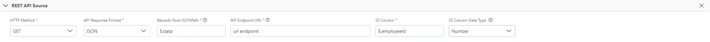

# Connections Functions

## Overview <a href="#overview" id="overview"></a>

The set of functions listed in this page are for use in the [Cinchy Connections Experience](https://cli.docs.cinchy.com/) when configuring data syncs.

* [@COLUMN]
* [​JSON\_ESCAPE​](connections-functions.md#json\_escape)
* [​URL\_ESCAPE​](connections-functions.md#url\_escape)
* [STRING\_ESCAPE()](connections-functions.md#string\_escape)
* [@ID](connections-functions#id)

## @COLUMN

The `@COLUMN` function connects a specific property within a REST API response to a column within Cinchy.

## JSON\_ESCAPE <a href="#json_escape" id="json_escape"></a>

This function is used in Connections to escape parameter values and be safe to use inside a JSON document without breaking it

This function can be used in a REST API connection anywhere that allows parameters to be, such as the URL endpoint, the Request Body, or a Post-Sync Script.

### Syntax

```sql
JSON_ESCAPE(@Parameter)
```

### Arguments

| Argument  | Description                                                                                              |
| --------- | -------------------------------------------------------------------------------------------------------- |
| Parameter | The parameter value that you want to escape to be safe to use inside a JSON document without breaking it |

### Example 1

The following example shows how you would use JSON\_ESCAPE in your REST API URL _(Image 1)._

This example uses an API and adds a value (@Parameter) that contains double quotes -- this could break the JSON structure, so you need to wrap the parameter with JSON\_ESCAPE().

<figure><figcaption><p>Image 1: Example 1</p></figcaption></figure>

### Example 2

The following example shows how you would use JSON\_ESCAPE in your REST API Request Body _(Image 2)._

This example uses an API and adds a value (@Parameter) that contains double quotes -- this could break the JSON structure, so you need to wrap the parameter with JSON\_ESCAPE().

<figure><figcaption><p>Image 2: Example 2</p></figcaption></figure>

## URL\_ESCAPE

This function is used in Connections to escape parameter values for use inside a URL without breaking it

**This function can be used in a REST API connection anywhere that allows parameters to be, such as the URL endpoint, the Request Body, or a Post-Sync Script.**

### Syntax

```sql
 URL_ESCAPE(@Parameter)
```

### Arguments

| Argument  | Description                                                                                             |
| --------- | ------------------------------------------------------------------------------------------------------- |
| Parameter | The parameter value that you want to escape for use inside a URL without breaking it |

### Example 1

The following example shows how you would use URL\_ESCAPE in your REST API URL _(Image 3)._

This example uses an API and adds a value (@Parameter) that contains the "&" symbol to the URL field. To properly read the URL, you need to wrap the parameter with URL\_ESCAPE(), **which will escape the & to be %26.**

<figure><figcaption><p>Image 3: Example 1</p></figcaption></figure>

## STRING\_ESCAPE()

The STRING\_ESCAPE() function escapes single quotes in data sync parameters by adding two single quotes. It can be used to wrap around parameters or column references respectively. This can be useful when you use it in a post sync script's CQL.

#### Syntax

```sql
STRING_ESCAPE(@yourparameter)
```

Or

```sql
STRING_ESCAPE(@COLUMN('yourcolumn'))
```

Or, when used inside of a post sync script or the sync body:

```sql
STRING_ESCAPE("@yourparameter")
```

#### Example

```
STRING_ESCAPE(This is my data sync's test)

will become

This is my data sync''s test
```

## @ID <a href="#id" id="id"></a>

The `@ID` function is specific to full file syncs. One of its primary uses in data syncs where the source is Cinchy Event Broker and the destination is a REST API to reconcile specific properties. 

### Syntax

```json
{
    "id": "@ID"
}
```

### Example

The following example uses the Cinchy Event Broker as a Source with a REST API destination.

 This scenario updates the data from the `employeeID` property to the source. The example below is a REST API response from our destination. 

```json

{
    "data": [
        {"employeeId": 1, 
        "name": "John"
        },
        {"employeeId": 2, 
        "name": "Ravi"
        }
    ]
}
```

Under **REST API SOURCE**, you would configure your endpoint to the URL of the API request. For this example, your response format would be **JSON**, your **Records Root JSONPath** is `$.data`, and your ID Column is `$.employeeID`. 

With this configuration, your `@ID` is now mapped to the `data.employeeID` in your JSON file.

<figure><figcaption><p>Image 3: REST API Source configuration</p></figcaption></figure>

Under **REST API** > **API Specification** > **Update Specification** > **Body**, the following content maps the `id` property to the `@ID` function:

```json
{
    "key":"@COLUMN('Name')",
    "id": "@ID"

}
```