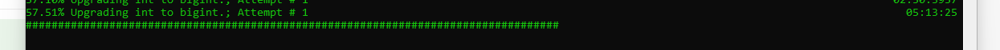

# Cinchy Upgrade Utility

## Overview

The Cinchy Upgrade Utility was first introduced in v5.2 to facilitate a mandatory INT to BigInt upgrade. This tool has continued to be used in subsequent releases as an easy way to deploy necessary changes to your Cinchy platform.

## 2. Considerations

* Upgrades will also be specified on the applicable [Upgrade Guide](../) page for each release.
* Depending on your upgrade path, certain upgrades must be performed in sequential and/or specific order. This will be clearly marked in the[ "Overview and Considerations"](cinchy-upgrade-utility.md#5.-upgrade-overviews-and-considerations) section.
  * **For example: To go from v5.1 to v5.5, you would first have to run the 5.2 upgrade utility and deploy the release. Once validated, you would then run the 5.5 upgrade and deploy that version.**
* Not all new releases will have changes that require the utility to be run. Review the table in section 4 for the full list.

## **3. Prerequisites**

* You will need to run this process as a user with admin/dbowner privileges to your database.
* You will need to have [.NET Core 6.0.x](https://dotnet.microsoft.com/en-us/download/dotnet/6.0) installed on the machine that you will run the utility on.
* Retrieve the Upgrade Utility from the [Cinchy Releases table.](https://cinchy.net/Tables/1477?rowHeight=Expanded)

## 4. Upgrades

<table><thead><tr><th width="115">Release</th><th width="180">Upgrade</th><th width="211">Kubernetes Upgrade</th><th>IIS Upgrade</th></tr></thead><tbody><tr><td>5.2</td><td><a href="cinchy-upgrade-utility.md#v5.2-int-to-bigint">INT to BigInt</a></td><td><a href="https://platform.docs.cinchy.com/deployment-guide/upgrade-guides/upgrading-cinchy-versions/kubernetes-upgrades/v5.2-kubernetes">Upgrade Guide</a></td><td><a href="https://platform.docs.cinchy.com/deployment-guide/upgrade-guides/upgrading-cinchy-versions/iis-upgrades/v5.2-iis">Upgrade Guide</a></td></tr><tr><td>5.5</td><td><a href="cinchy-upgrade-utility.md#v5.5-4000-character-bug">4000 Character Bug </a></td><td><a href="https://platform.docs.cinchy.com/deployment-guide/upgrade-guides/upgrading-cinchy-versions/kubernetes-upgrades/v5.5-kubernetes">Upgrade Guide</a></td><td><a href="https://platform.docs.cinchy.com/deployment-guide/upgrade-guides/upgrading-cinchy-versions/iis-upgrades/v5.5-iis">Upgrade Guide</a></td></tr></tbody></table>

## 5. Upgrade Overviews and Considerations

<details>

<summary>v5.2: INT to BigInt</summary>

## Overview

Cinchy v5.2 introduced the update **from INT to BigInt** data types to increase the number of possible Cinchy IDs that can be generated. This in turn allows the creation of more records within one table, so that you can create and manage larger data sets.

**Previous Limit:** 2,147,483,647 (2^31-1) Cinchy IDs per table

**Updated Limit:** 9,223,372,036,854,775,807 (2^63-1) Cinchy IDs per table

<mark style="color:red;">**This upgrade is REQUIRED**</mark>** when upgrading from v5.1 or lower to v5.2 or higher.**

## **Considerations**

* **If you are upgrading from any non-5.x version (i.e., 3.x or 4.x),** we recommend first upgrading to v5.1.4 to process the major database change. Once v5.1.4 has been deployed, you may run the 5.2 utility upgrade.
* To run the 5.2 upgrade, use the **-v "5.2"** flag in the upgrade utility. Remember to deploy the release once the upgrade is validated.

</details>

<details>

<summary>v5.5: 4000 Character Bug</summary>

## **Overview**

To upgrade to Cinchy version 5.5, you must run the Upgrade Utility to fix a row-breaking issue that could be triggered on cells with over 4000 characters, where you are unable to update any column in your record.

<mark style="color:red;">**This upgrade is REQUIRED**</mark> when upgrading to Cinchy v5.5.

## Considerations

* If you are upgrading from any version lower than 5.2, you must first perform the v5.2 INT to BigInt upgrade and deploy that release.
* To run the 5.5 upgrade, use the **-v "5.5"** flag in the upgrade utility. Remember to deploy the release once the upgrade is validated.

</details>

## 6. Upgrade Instructions


We recommend you follow this process **during off-peak hours.**


1. Turn off your Cinchy platform. _(Note: This step is only required for the 5.2 upgrade)_
   1. In a Kubernetes deployment,[ you can do so via ArgoCD.](../../deployment-installation-guides/kubernetes-deployment-installation/disabling-your-kubernetes-applications.md)
   2. In an IIS Deployment:
      1. Open your Windows Services Panel.
      2. Select **IIS Admin Service.**
      3. Stop the service.
      4. Right-click **IIS Admin Service** and select **Properties.**
      5. Change **'Start Up Type'** to '**Disabled'.**
2. **Create a backup snapshot** of your platform.
   1. In a Kubernetes deployment on AWS, you can [follow the documentation here.](https://docs.aws.amazon.com/AWSEC2/latest/UserGuide/ebs-creating-snapshot.html#ebs-create-snapshots)
   2. In a Kubernetes deployment on Azure, you can [follow the documentation here.](https://docs.microsoft.com/en-us/azure/virtual-machines/snapshot-copy-managed-disk?tabs=portal)
   3. In an IIS Deployment, you can [follow the documentation here.](https://docs.microsoft.com/en-us/iis/web-hosting/web-server-for-shared-hosting/create-a-backup-with-appcmd)
3. Retrieve the Upgrade Utility from the [Cinchy Releases table](https://cinchy.net/Tables/1477?rowHeight=Expanded) if you haven't already.
4. Run the following command through a command window as an admin/dbowner, using the table below as a guide.

```
dotnet cinchy.upgrade-utility.dll -d "TSQL" -s "Server=LAPTOP-4SUPR0L6;Database=T6;User ID=cinchy;Password=cinchy;Trusted_Connection=False;Connection Timeout=30;Min Pool Size=10;Encrypt=False" -v "5.2"
```

| Value  | Description                                                                                                                                                                |
| ------ | -------------------------------------------------------------------------------------------------------------------------------------------------------------------------- |
| **-d** | **Mandatory.** "Database type". This can be either "TSQL" or "PGSQL".                                                                                                      |
| **-s** | **Mandatory.** "Connection String". You must provide the unencrypted connection string for your database.                                                                  |
| **-v** | **Mandatory.** This specifies the upgrade version that you wish to deploy. _Ex: specifying "5.2" will run the 5.2 upgrade._                                                |
| **-c** | Optional and **not recommended** to be used on your first run of the utility. This "clean up" value will delete any extra metadata the application created on the database |

5\. You will see the below progress bar as your upgrade completes _(Image 1)_. Once it is done, you will see a **VALIDATION PASSED** check.


Tip: Click on the image below to enlarge it.


<figure><figcaption><p>Image 1: You will see the below progress bar as your upgrade completes </p></figcaption></figure>


If there are any errors during execution or your validation fails, we suggest that you restore your database from the backup and contact Cinchy support.


6\. [Deploy your Cinchy Upgrade](https://platform.docs.cinchy.com/deployment-guide/upgrade-guides/upgrading-cinchy-versions)[. ](../)


Note: You must deploy whichever version of the platform you ran the upgrade utility for.


7\. If it was turned off in step 1, turn your Cinchy platform back on.

&#x20;      1\. In a Kubernetes deployment, [you can do so via Argo CD](../../deployment-installation-guides/kubernetes-deployment-installation/disabling-your-kubernetes-applications.md#2.-re-enabling-your-applications)

&#x20;      2\. In an IIS deployment:

&#x20;           1\. Open your Windows Services Panel.

&#x20;           2\. Select **IIS Admin Service.**

&#x20;           3\. Start the service.

&#x20;           4\. Right-click **IIS Admin Service** and select **Properties.**

&#x20;           5\. Change **'Start Up Type'** to '**Enabled'.**
