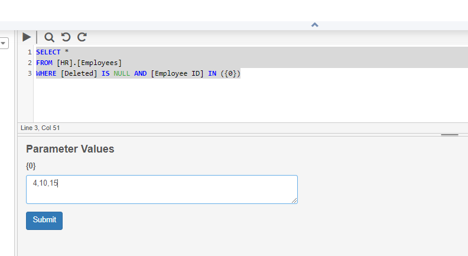

# Frequently Asked Questions

## Table of Contents

|                                                                                                                                                                                                                                                       |
| ----------------------------------------------------------------------------------------------------------------------------------------------------------------------------------------------------------------------------------------------------- |
| [#can-i-get-a-record-count-from-a-delimited-file-before-running-the-cli](frequently-asked-questions.md#can-i-get-a-record-count-from-a-delimited-file-before-running-the-cli "mention")                                                               |
| [#can-i-restore-my-deleted-data](frequently-asked-questions.md#can-i-restore-my-deleted-data "mention")                                                                                                                                               |
| [#can-i-send-multiple-comma-delimited-values-to-a-query-parameter-i.e.-234-233-365-to-be-used-in-where](frequently-asked-questions.md#can-i-send-multiple-comma-delimited-values-to-a-query-parameter-i.e.-234-233-365-to-be-used-in-where "mention") |
| [#cinchy-dates-are-being-saved-as-a-1900-01-01-when-updating-using-a-variable](frequently-asked-questions.md#cinchy-dates-are-being-saved-as-a-1900-01-01-when-updating-using-a-variable "mention")                                                   |
| [#does-a-row-filter-restrict-access-for-a-cinchy-administrator](frequently-asked-questions.md#does-a-row-filter-restrict-access-for-a-cinchy-administrator "mention")                                                                                 |
| [#how-can-i-automatically-check-if-a-cli-data-sync-was-successful-or-failed](frequently-asked-questions.md#how-can-i-automatically-check-if-a-cli-data-sync-was-successful-or-failed "mention")                                                       |
| [#how-can-i-check-for-platform-errors](frequently-asked-questions.md#how-can-i-check-for-platform-errors "mention")                                                                                                                                   |
| [#how-can-i-enter-a-new-line-into-a-field-in-manage-data](frequently-asked-questions.md#how-can-i-enter-a-new-line-into-a-field-in-manage-data "mention")                                                                                             |
| [#how-can-i-prevent-wrong-data-loading-in-from-external-applications](frequently-asked-questions.md#how-can-i-prevent-wrong-data-loading-in-from-external-applications "mention")                                                                     |
| [#how-can-i-see-who-has-modified-my-data](frequently-asked-questions.md#how-can-i-see-who-has-modified-my-data "mention")                                                                                                                             |
| [#how-do-i-create-a-cinchy-user-with-a-set-password](frequently-asked-questions.md#how-do-i-create-a-cinchy-user-with-a-set-password "mention")                                                                                                       |
| [#how-do-i-get-the-change-history-through-cql](frequently-asked-questions.md#how-do-i-get-the-change-history-through-cql "mention")                                                                                                                   |
| [#how-do-i-insert-update-and-delete-links-in-a-multi-select-field-using-cql](frequently-asked-questions.md#how-do-i-insert-update-and-delete-links-in-a-multi-select-field-using-cql "mention")                                                       |
| [#how-do-i-know-which-version-of-cinchy-i-am-running](frequently-asked-questions.md#how-do-i-know-which-version-of-cinchy-i-am-running "mention")                                                                                                     |
| [#how-do-i-map-a-parameters-value-to-one-of-my-target-columns](frequently-asked-questions.md#how-do-i-map-a-parameters-value-to-one-of-my-target-columns "mention")                                                                                   |
| [#how-do-i-parse-a-pipe-delimited-file-using-the-cli](frequently-asked-questions.md#how-do-i-parse-a-pipe-delimited-file-using-the-cli "mention")                                                                                                     |
| [#how-do-i-remove-the-leading-0-from-an-incoming-field-using-the-cli](frequently-asked-questions.md#how-do-i-remove-the-leading-0-from-an-incoming-field-using-the-cli "mention")                                                                     |
| [#how-do-i-clone-a-cinchy-table](frequently-asked-questions.md#how-do-i-clone-a-cinchy-table "mention")                                                                                                                                               |
| [#how-do-i-clone-a-domain](frequently-asked-questions.md#how-do-i-clone-a-domain "mention")                                                                                                                                                           |
| [#i-am-unable-to-use-coalesce-with-a-link-column-in-a-calculated-column](frequently-asked-questions.md#i-am-unable-to-use-coalesce-with-a-link-column-in-a-calculated-column "mention")                                                               |
| [#i-cannot-disable-change-approvals](frequently-asked-questions.md#i-cannot-disable-change-approvals "mention")                                                                                                                                       |
| [#i-cannot-find-the-cinchy-.-table-access-control-table](frequently-asked-questions.md#i-cannot-find-the-cinchy-.-table-access-control-table "mention")                                                                                               |
| [#i-cannot-find-the-column-i-want-to-link-to-even-though-the-column-is-present-in-the-table](frequently-asked-questions.md#i-cannot-find-the-column-i-want-to-link-to-even-though-the-column-is-present-in-the-table "mention")                       |
| [#i-have-access-to-a-table-but-i-cannot-see-any-rows](frequently-asked-questions.md#i-have-access-to-a-table-but-i-cannot-see-any-rows "mention")                                                                                                     |
| [#is-it-possible-to-correct-replace-a-table-or-columns-guid](frequently-asked-questions.md#is-it-possible-to-correct-replace-a-table-or-columns-guid "mention")                                                                                       |
| [#my-insert-update-statement-is-making-multiple-changes-instead-of-just-one](frequently-asked-questions.md#my-insert-update-statement-is-making-multiple-changes-instead-of-just-one "mention")                                                       |
| [#my-query-parameter-is-not-working](frequently-asked-questions.md#my-query-parameter-is-not-working "mention")                                                                                                                                       |
| [#null-values-are-not-updating-correctly-in-salesforce-using-the-data-sync](frequently-asked-questions.md#null-values-are-not-updating-correctly-in-salesforce-using-the-data-sync "mention")                                                         |
| [#passing-parameters-to-a-query-called-with-exec](frequently-asked-questions.md#passing-parameters-to-a-query-called-with-exec "mention")                                                                                                             |
| [#some-of-the-columns-have-been-rearranged-under-the-default-all-data-view](frequently-asked-questions.md#some-of-the-columns-have-been-rearranged-under-the-default-all-data-view "mention")                                                         |
| [#the-multi-select-option-on-the-link-column-is-disabled](frequently-asked-questions.md#the-multi-select-option-on-the-link-column-is-disabled "mention")                                                                                             |
| [#what-permissions-are-needed-for-a-user-to-be-able-to-create-and-edit-views](frequently-asked-questions.md#what-permissions-are-needed-for-a-user-to-be-able-to-create-and-edit-views "mention")                                                     |

## Can I get a record count from a delimited file before running the CLI?

You can use PowerShell to count the lines in a delimited file and based on the result decide if you will run the CLI.

```javascript
$row_count=(get-content sample_150k.csv).length
write-host $row_count

If ($row_count -lt 50000)
{
     exit
}
else {
      Write-host "run CLI"
}
```

There is currently no way for you to find out how many records will be inserted/updated/deleted if you run a CLI without performing the sync.

## Can I restore my deleted data?

If the record is still in the table, but has been overwritten by mistake, access your **Collaboration Log** for the row, and restore back to the correct version. &#x20;

If your row has been deleted by mistake, access your **Recycling Bin,** locate the row and restore it.

The only way to truly delete data on the platform is through [Data Erasure](guides-for-using-cinchy/builder-guides/creating-tables/data-controls/data-erasure.md) and [Data Compression.](guides-for-using-cinchy/builder-guides/creating-tables/data-controls/data-compression.md)

## Can I send multiple comma-delimited values to a query parameter? \[i.e. 234,233,365 to be used in WHERE \[Id] IN (@param)]

For example: 4,10,15 to be used in WHERE \[Id] IN (@param)

This can be done by using parameters in **{}**, such as **{0},{1}**,...&#x20;

These will be replaced with the exact text when running the query.&#x20;

For example: ​ **SELECT \* FROM \[HR].\[Employees] WHERE \[Deleted] IS NULL AND \[Employee ID] IN ({0})** _(Image 1)._



## Cinchy dates are being saved as a 1900-01-01 when updating using a variable

When updating a date field using a variable, and no value is entered for that variable, the date field will be 1900-01-01. To avoid this, use a case statement to replace the empty string with NULL, as shown in the following example:

```sql
UPDATE E
SET E.[Date Hired]=CASE WHEN @dhired<>'' THEN @dhired ELSE NULL END
FROM [HR].[Employees] E
WHERE E.[Deleted] IS NULL AND [Employee ID]=@empid
```

## Does a row filter restrict access for a Cinchy administrator?

Currently Cinchy Administrators have access to view/edit/approve all data in the platform. There is no way currently to restrict access for Cinchy administrators.

A workaround is to create a separate "administrators" group which has edit access to all Cinchy system tables, and just leave the "admin" user account or superadmins as "Cinchy administrators."

## How can I automatically check if a CLI data sync was successful or failed?

You can check if a data sync was successful by its exit code. Below is sample code in Powershell to check for the exit code and what they mean.

```bash
Invoke-Expression $CLICommand
switch ($LASTEXITCODE) {
  0 { Write-Host "Completed without errors" }
  1 { Write-Host "Execution failed" }
  2 { Write-Host "Completed with validation errors" }
}

```

From the command prompt the following will also return the error code:

```bash
echo %ErrorLevel%
```

## How can I check for platform errors?

**In Version 4:**

First check **\<base URL>/elmah**, which stores web-related induced errors.

Then check the logs, which can be accessed from **\<base URL>/admin/index**.

Cinchy logs will contain all exceptions thrown by the Cinchy Web application. This includes failed queries, stack overflows and much more.

CinchySSO logs will contain **IDP errors.**

**In Version 5:** Errors and Logs can be found through the [Opensearch Dashboard.](https://opensearch.org/docs/latest/dashboards/index/)

## How can I enter a new line into a field in Manage Data?

You can add line breaks in a cell on the UI, the same way as in Excel, by typing **Alt+Enter**. If you use the expanded row heights option, or manually expand the row, it will show the line breaks.

## How can I prevent wrong data loading in from external applications?

The best way to load data from external sources into Cinchy, is by using a [data sync. ](data-syncs/getting-started-with-data-syncs.md)

You can do the following to preview your changes:

* Create staging tables to validate the data first.
* Use formatting rules in Cinchy, to highlight data that is not valid.
* Configure a CLI using a Cinchy Query source to move the data from the staging tables to the permanent tables.

## How can I see who has modified my data?

Right click on the row you want additional information and select the Collaboration Log.

You can also add the "Modified By" and "Modified" columns into the current view/to your query if you want to see it for multiple rows at once.

## How do I create a Cinchy user with a set password?

One Time
&#x20;setup:

1. Open the Users table
2. For the password of this user, copy the admin user's password and paste it into the Password field of **"defaultuser".**
3. Set the Password Expiration Timestamp to today
4. In an Incognito browser, navigate to the Cinchy website
5. Sign in as **defaultuser** with the admin user password
6. Cinchy will ask you to change the password for **defaultuser**, change it to a default password you will give out every time you create an account.
7. In the original session window, refresh the Users table and remove the Password Expiration Timestamp for **defaultuser**.

Each time, for new users:

1. Open the Users table
2. Create the new user, for example **"sandip"**
3. For the password of this user, copy the **"defaultuser"** password and paste it into the Password field of **"sandip".**
4. Set the Password Expiration Timestamp to today
5. Give the user their username and friendly password created in step 7 above. They will be asked to change their password on first sign in.

## How do I get the change history through CQL?

You write the query for the records for which you want the change history, including system columns like \[Version], \[Created], ... and the columns for which you like to see the changes.

You can add an **ORDER BY \[Version] (either ASC or DESC)**

Then you change the query return type to "Query Results (Including Version History
)"

The following query will show when the Cinchy instances were upgraded.

```javascript
SELECT [Version], [Modified], [Model Version]
FROM [Cinchy].[Models]
WHERE [Deleted] IS NULL AND [Name]='Cinchy'
ORDER BY [Version] DESC
```

## How do I insert, update, and delete links in a multi-select field using CQL?

Removing  and updating a multi-select a link, is the same as setting the link field. The field needs to be updated with the list of values.

The value is a concatenated string of '\[Cinchy Id],\[Version],\[Cinchy Id],\[Version],\[Cinchy Id],\[Version]' from the lookup values

```javascript
UPDATE T
SET T.[Multi-Link Field Name] = '1,1,2,1,3,1'
FROM [Domain].[Table Name] T
WHERE T.[Deleted] IS NULL AND ...
```

In this example it would set \[Multi-Link Field Name] to values with \[Cinchy Id] 1, 2, and 3.
&#x20;The version after each Cinchy Id should be 1.


You must provide the full list of multi-select values. If your field was '1,2' and you update it with '3,1' it will end up as '3', not '1,2,3'.


## How do I know which version of Cinchy I am running?

Navigate to **\<baseURL>/healthcheck**

(ex. if your current URL is https://cinchy.mycompany.com/Tables/123?viewId=0 then you would navigate to https://cinchy.mycompany.com/healthcheck)

The response looks this:

```javascript
{ 
  "component": "Cinchy", 
  "version": "4.14.0.0", 
  "ipAddress": [ 
      "172.31.14.171", 
      "172.19.64.1" 
  ], 
  "systemTime": "2020-06-18T19:43:54.1692859Z", 
  "status": "Green", 
  "healthChecks": [ 
    { 
      "name": "Database Connectivity", 
      "description": "Validates that the application can connect to the database",
      "status": "Green" 
   } 
 ] 
}
```

In this case your Cinchy version is 4.14.0.0

If you would like to use the health check link for monitoring of the Cinchy application you can add "**return503OnFailure=true"** to the URL

## How do I map a parameter's value to one of my target columns?

Use the model loader to load it back in the system (/apps/modelloader).

You create a calculated column in the source and give it the value of the parameter.

For each table, export and import the data via the UI.

```javascript
<Parameters>
    <Parameter name="snapshotDate" />
</Parameters>
...
<Schema>
...
    <CalculatedColumn name="Snapshot Date" formula="@snapshotDate" dataType="Date" />
<Schema>
```

Then map the calculated source column to the target.
&#x20;The order of the columns in the source is important. If your source is a file, put the calculated columns at the end in the source, after all the actual columns in the file.

## How do I parse a pipe delimited file using the CLI?

Set the delimiter to "|".

```javascript
<DelimitedDataSource delimiter="|" textQualifier="&quot;"  headerRowsToIgnore="2" path="@filePath" encoding="UTF8">
```

## How do I remove the leading 0 from an incoming field using the CLI?

This can be done by using Transformations in the sync configuration of a column. Here is an example:

```javascript
<Column name="Value 2" dataType="Text" >
      <Transformations>
            <StringReplacement pattern="^0*" replacement="" />
      </Transformations>
</Column>
```

The pattern contains a regular expression:

^ - anchor for the beginning of the string

0 - the string to replace&#x20;

\* - quantifier to be applied to 0 or more occurrences

## How do I clone a Cinchy table?

1. Export the Model to XML from the Design Table info tab
2. Open the exported model in an editor and change the name of the model
3. Change the name of the table
4. remove the guids from the table in the model  and save the file
5. Use the modelloader at `<cinchy base URL>/apps/modelloader` to upload the modified model
6. Export the data from the Manage Data screen of the initial table and import it in the new table

## How do I clone a domain?

If you just have a group of tables, see the instructions below. If you have tables, queries, you want to port the permissions, etc. you can use this: [Data Experience Deployment - Cinchy Platform Documentation](guides-for-using-cinchy/builder-guides/cinchydxd-utility/)

Table only instructions:

&#x20;1\. Create a dummy Data Experience and add all your tables from your domain to it _(Image 2)._

.png>)

2\. Hit the following endpoint with the GUID in your row:

**\<CinchyURL>/api/createdxversion?guid=\<GUID>**

## I am unable to use COALESCE with a link column in a calculated column

If \[Person 1] and \[Person 2] are Link columns and \[Member] is a Text column, a calculated column with the following expression will fail to save:

**COALESCE(\[Person 1],\[Person 2],\[Member])**

Please cast the link columns to VARCHAR:

**COALESCE(CAST(\[Person 1] AS VARCHAR(50)),CAST(\[Person 2] AS VARCHAR(50)),\[Member])**

## I cannot disable Change Approvals

This is caused by records in Draft status. To retrieve these records, run a query with return type Query Results (Including Draft Data).

```javascript
SELECT T.*
FROM [Your Domain].[Your Table] T
WHERE T.[Approval State] <> 'Approved'
```

After approving these records, you will be able to disable change approval.


You may have to restore cancelled records, approve them, and delete them so that everything is approved.


## I cannot find the \[Cinchy].\[Table Access Control] table

The \[Cinchy].\[Table Access Control] table does not show in the Market Place, but you can query for the data in the table.

```javascript
SELECT *
FROM [Cinchy].[Table Access Control]
WHERE [Deleted] IS NULL AND [Table]='HR.Employees'
```

## I cannot find the column I want to link to even though the column is present in the table

In this example it would set \[Multi-Link Field Name] to values with \[Cinchy Id] 1, 2, and 3.
&#x20;The version after each Cinchy Id should be 1."

Columns do not "Allow Linking" by default. Check the properties of the column in the original table and make sure that in “Show Advanced” the “Allow Linking” checkmark box is selected. If you do not have Design Table access to that table, you will need to ask someone who does to do it.

## I have access to a table but I cannot see any rows

There are a couple reasons why you may not be able to see any rows:

* View Filter
* Data access controls
* Error with the View or Table

#### View Filter

Check the All Data view and see if there is data there, if that is the case but a particular view has no rows, there could be a filter on the view. For example, if there is a "Due Soon" or "My Actions" view, it could just be that there are no records assigned to you that require actioning.

#### Data Access Controls

Access controls set on the table could cause you to have access to 0 records. Since you are able to set row level filters in Cinchy, it may be the case that the permissions of the table has not changed, but the data has changed such that you no longer have permission or vice versa.

**Error**

There may be an error on the view. If the bottom of the page does not show 0 records then there may be an error on the page _(Image 3)._

.png>)

## Is it possible to correct/replace a table or column's GUID?

It can be done. It is very unlikely that the GUID you want to change to is already allocated, but you  should still check. Filter the \[Cinchy].\[Table Columns] for the new GUID. You should not find it. Then replace it in two places:

* the json field in \[Cinchy].\[Tables] - replace it in the column definition
* the GUID field in \[Cinchy].\[Table Columns]

To replace the table GUID, replace it in the json in \[Cinchy].\[Tables] and in the GUID field in \[Cinchy].\[Tables].

When you are done, restart the Cinchy UI. ​

## My Insert/Update statement is making multiple changes instead of just one

A query like the following will cause multiple inserts instead of one if your result type is set to Query Results instead of # of Rows Affected.

```javascript
INSERT INTO [Customer].[Tickets] ( [Ticket Id], [Subject] )
VALUES ( 1900, 'This is a Test' );
SELECT [Cinchy Id],
       [Ticket Id],
       [Subject]
FROM [Customer].[Tickets]
WHERE [Deleted] IS NULL
```

The same applies to UPDATE statements.

If you need to perform inserts and updates in a query and want to return data at the end, another option is to use the "Single value (First Column of First Row)" return type, which will only be able to return a single value.

## My query parameter is not working

When I pass a value to the following query, the result is empty.

```javascript
DECLARE @nbdays AS INT;
SELECT @nbdays;
```

The query works without the DECLARE statement. When the DECLARE statement is present, the input variable is ignored, and needs to be SET. In order to still get the variable from the input, a second variable is needed.

```javascript
DECLARE @nbdays AS INT;
SET @nbdays = @inputDays;
SELECT @nbdays;
```

## Null values are not updating correctly in Salesforce using the data sync

When performing a data sync with a Salesforce target, you need to replace nulls with '#N/A' in the source. You can use ISNULL(\[Column],'#N/A') in the source query. The following is a link to the Salesforce documentation related to this topic:

[https://help.salesforce.com/articleView?id=000328822\&language=en\_US\&type=1\&mode=1](https://help.salesforce.com/articleView?id=000328822\&language=en\_US\&type=1\&mode=1)

## Passing Parameters to a query called With Exec

Declare and set the parameters before invoking the query:

```sql
DECLARE @dep AS VARCHAR ( 500 );
SET @dep = 'Accounting';
EXEC [HR].[Employees and Departments]
```

\[HR].\[Employees and Departments] is:

```sql
SELECT [Employee ID],
       [Full Name],
       [Date Hired],
       [Department]
FROM [HR].[Employees]
WHERE [Deleted] IS NULL
      AND [Department] = @dep
```

## Some of the columns have been rearranged under the default "All Data" view

The default All Data view displays the columns in the same order as in Design Table. But you can create a view and change the columns displayed and their order.

## The multi-select option on the Link Column is disabled

Once link column is added to a table and saved, the multi-select checkbox should be disabled. If you need to change the option, you need to rename the column and create a new link column with the correct option.

## What permissions are needed for a user to be able to create and edit views?

The user needs to have "Design Table" permissions granted for the table where he/she will create or edit views and also needs to have the "Can Design Tables" checked in the \[Cinchy].\[Users] table.
