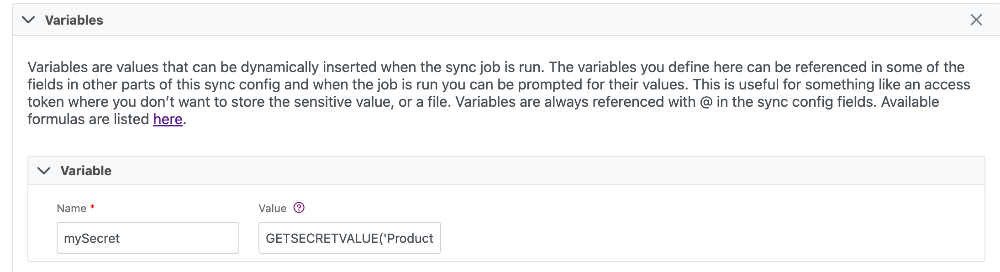

# Grafana

## Table of Contents

| Table of Contents                                                                        |
| ---------------------------------------------------------------------------------------- |
| [#1.-grafana-overview](grafana.md#1.-grafana-overview "mention")                         |
| [#2.-getting-started-with-grafana](grafana.md#2.-getting-started-with-grafana "mention") |
| [#3.-recommended-dashboards](grafana.md#3.-recommended-dashboards "mention")             |
| [#4.-setting-up-alerts](grafana.md#4.-setting-up-alerts "mention")                       |
| [ 5. Recommended Alerts](grafana.md#5.-recommended-alerts)                               |
| [6. Updating your Grafana Password](grafana.md#6.-updating-your-grafana-password)        |
|                                                                                          |

## 1. Grafana Overview

[Grafana](https://grafana.com/) is an open source analytics and interactive visualization web application. When connected to your Cinchy platform, it provides charts, graphs, and alerting capabilities _(Image 1)_.&#x20;

Grafana, and its paired application [Prometheus](https://prometheus.io/) (which consumes metrics from the running components in your environment) is the recommended visualization application for Cinchy v5 on Kubernetes.&#x20;

.png>)

## 2. Getting Started with Grafana

Grafana has a robust library of documentation of tutorials designed to help you learn the fundamentals of the application. We have listed a few notable ones below:


When using the default configuration pairing of Grafana and Prometheus, Prometheus is already set up as a data source in your metrics dashboard.


* [Exploring your Metrics](https://grafana.com/tutorials/grafana-fundamentals/?utm\_source=grafana\_gettingstarted#explore-your-metrics)
* [Best Practices for Creating Dashboards](https://grafana.com/docs/grafana/latest/best-practices/best-practices-for-creating-dashboards/)
* [Building a Dashboard](https://grafana.com/tutorials/grafana-fundamentals/?utm\_source=grafana\_gettingstarted#build-a-dashboard)
* [Guide to Dashboard Types and Capabilities](https://grafana.com/blog/2022/06/06/grafana-dashboards-a-complete-guide-to-all-the-different-types-you-can-build/)
* [Creating a Managed Alert](https://grafana.com/tutorials/grafana-fundamentals/?utm\_source=grafana\_gettingstarted#create-a-grafana-managed-alert)
* [All Documentation](https://grafana.com/docs/)

### 2.1 Accessing your Saved Dashboards:

There are some saved dashboards that come out of the box with your Cinchy deployment. These dashboards will provide a great jumping off point for your metrics monitoring, and you can always customize, manage, and add further dashboards at your leisure.

1. Navigate to the **left navigation** pane, select the **Dashboards icon > Manage** _(Image 2)._

.png>)

2\. You will see a list of all of the Dashboards available to you _(Image 3)_. Clicking on any of them will take you to a full metrics view _(Image 4)._

.png>)

.png>)

3\. You can favourite any of your commonly used or most important dashboards by clicking on the star _(Image 5)._

.png>)

4\. Once you have favourited a dashboard, you can easily find it by navigating to the **left navigation** pane, select the **Dashboards icon > Home.** This will open the Dashboards Home. You can see both your favourite and your recent dashboards in this view _(Image 6)_

.png>)

## 3. Recommended Dashboards

Your Cinchy v5 deployment comes with some out-of-the-box dashboards premade for you. You are able to customize these to suit your specifications. The following are a few notable ones:

### 3.1 Kubernetes/Compute Resources/Cluster

**Purpose:** This dashboard provides a general overview of your entire cluster including all of your environments and pods _(Image 7)._

.png>)

**Metrics:**

The following are some example metrics that you could expect to see from this dashboard:

* CPU Usage
* CPU Quota
* Memory Usage&#x20;
* Memory Requests
* Current Network Usage
* Bandwidth (Transmitted and Received)
* Average Container Bandwidth by Namespace
* Rate of Packets
* Rate of Packets Dropped
* Storage IO & Distribution

### 3.2 Kubernetes/Compute Resources/Namespace (Workloads)

**Purpose:** This dashboard is useful for looking at environment specific details _(Image 8)_. You can use the **namespace drop down menu** to select which environment you want to visualize _(Image 9)_. This can be particularly helpful during load  testing. You are also able to drill down to a specific workload by clicking  on its name.

.png>)

.png>)

**Metrics:**

The following are some example metrics that you could expect to see from this dashboard**:**

* CPU Usage
* CPU Quota
* Memory Usage&#x20;
* Memory Quota
* Current Network Usage
* Bandwidth (Transmitted and Received)
* Average Container Bandwidth by Workload
* Rate of Packets
* Rate of Packets Dropped

## 4. Setting Up Alerts

Grafana allows you to set up push alerts against your dashboards and queries. Once you have created your dashboard, you can follow the steps below to set up your alert.


Grafana does not have the capability to run alerts against queries with template variables.



To send emails out from Grafana, you need to configure your SMTP. This would have been done in the automations script run during your initial Cinchy v5 deployment. **If you did not input this information at that time**, you must do so before setting up your email alerts.


### 4.1 Set Up Your Notifications Channel

Your notifications channel refers to who will be receiving your alert. To set one up:

1. Click on the Alert icon on the left navigation tab _(Image 10)_, and locate **"Notifications Channel"**

.png>)

2\.  Click the **"Add a Channel"** button

3\. Add in the following parameters, including any optional checkboxes you wish to use _(Image 11)_:

**Name:** The name of this channel

**Type:** You have several options here, but email is the most common

**Addresses:** Input all the email addresses you want to be notified of this alert, separated by a comma



4\. Click **Test** to send out a test email, if desired.

5\. **Save** your Notification Channel

### 4.2 Setting up your Alert

The following details how to set up alerts on your dashboards. You can also set up alerts upon creation of your dashboard from the same window.

1. Navigate to the dashboard and dashboard panel that you want to set up an alert for. In this example, we are setting up an **alert for CPU usage on our cluster.**
2. Click on the **dashboard name > Edit**
3. Click on the **Alert tab** _(Image 12)_.

.png>)

4\. Input the following parameters to set up your alert _(Image 13):_

* **Alert Name:** A title for your alert
* **Alert Timing:** Choose how often to evaluate and for how long. In this example it is evaluated every minute for five minutes.
* Conditions: Here you can set your threshold conditions for when an alert will be sent out. In this example, it is sent when the average of query A is above 75.
* Set what happens if there's **no data, or an error in your data**
* Add in your **notification channel** (i.e., who will be sent this notification)
* Add a **message** to accompany the alert.
* Click **Apply > Save** to finalize your alert.


Click on an image to enlarge it.


.png>)

## 5. Recommended Alerts

Below are a few alerts we recommend setting up on your Grafana.

### 5.1 CPU Usage

Set up this alert to notify you when the CPU Usage on your nodes exceeds a specified limit.

#### **Dashboard Query:**&#x20;

You can use the following example queries to set up a dashboard that will capture CPU Usage by Node _(Image 14)._

```
avg by (node_name) (100 - ((avg by (cpu,node_name) (irate(node_cpu_seconds_total{mode="idle"}[1m]))) * 100))
```

```
100 - ((avg by (cpu,node_name) (irate(node_cpu_seconds_total{mode="idle"}[1m]))) * 100)
```

<figure><figcaption><p>Image 14: CPU Usage Dashboard Query</p></figcaption></figure>

#### Alert:

Set up your alert. This example uses a threshold limit of 75 _(Image 15)._

<figure><figcaption><p>Image 15: CPU Threshold Alert</p></figcaption></figure>

### 5.2 Memory Usage

Set up this alert to notify you when the Memory Usage on your nodes exceeds a specified limit.

#### Dashboard Query:

You can use the following example queries to set up a dashboard that will capture CPU Usage by Node _(Image 16)_

```
((node_memory_MemTotal_bytes-node_memory_MemAvailable_bytes) / (node_memory_MemTotal_bytes))*100
```

<figure><figcaption><p>Image 16: Memory Usage Query</p></figcaption></figure>

#### Alert:

Set up your alert. This example uses a threshold limit of 85 _(Image 17)._

<figure><figcaption><p>Image 17: Memory Usage Alert</p></figcaption></figure>

### 5.3 Disk Usage

Set up this alert to notify you when the Disk Usage on your nodes exceeds a specified limit.

#### Dashboard Query:

You can use the following example queries to set up a dashboard that will capture Disk Usage by Node _(Image 18)_

```
(sum((node_filesystem_size_bytes))by(node_name) - sum((node_filesystem_free_bytes))by(node_name)) *100/(sum((node_filesystem_avail_bytes))by(node_name)+(sum((node_filesystem_size_bytes))by(node_name) - sum((node_filesystem_free_bytes))by(node_name)))
```

<figure><figcaption><p>Image 18: Disk Usage Query</p></figcaption></figure>

#### Alert:

Set up your alert. This example uses a threshold limit of 80 _(Image 17)._

<figure><figcaption><p><em>Image 17: Disk Usage Alert</em></p></figcaption></figure>

### 5.4 Iowait

Set up this alert to check the amount of iowait from the CPU. A high value usually indicates a slow/overloaded HDD or Network.

#### Dashboard Query:

You can use the following example queries to set up a dashboard that will capture the CPU Iowait _(Image 19)._

```
(sum(irate(node_cpu_seconds_total{mode="iowait"}[1m]))by(node_name) * 100 / 4)
```

<figure><figcaption><p><em>Image 18: Iowait Query</em></p></figcaption></figure>

#### Alert:

Set up your alert. This example uses a threshold limit of 60 _(Image 19)._

<figure><figcaption><p><em>Image 19: Iowait Alert</em></p></figcaption></figure>

## 6. Updating your Grafana Password


This capability was added in Cinchy v5.4.


Your Grafana password can be updated in your **deployment.json** file (you may have renamed this during your original deployment).

1. Navigate to **"cluster\_component\_config" > "grafana".**
2. The default password is set to **"prom-operator"**; update this with your preferred new password, written in clear text.
3. Run the below command in the root directory of your **devops.automations** repo to update your configurations. If you have changed the name of your deployment.json file, make sure to update the command accordingly.

```
dotnet Cinchy.DevOps.Automations.dll "deployment.json"
```

4\.  Commit and push your changes.

5\. If your environment is not set-up to automatically apply upon configuration,navigate to the **ArgoCD** portal and refresh your component(s). If that does not work, **re-sync.**
