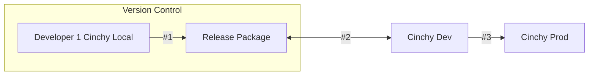
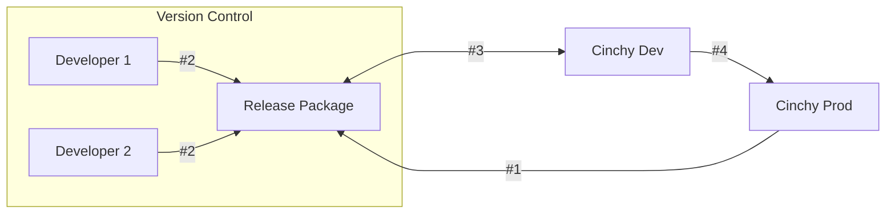

# CinchyDXD 2.0 workflow

## Overview

The CinchyDXD 2.0 workflow depends on four system tables within Cinchy:

1. [**Data Experience Definitions Table**](/guides-for-using-cinchy/builder-guides/cinchydxd-utility/References/data-experience-definitions.md): This is where you define the data experience. This includes tables, queries, views, formatting rules, and user defined functions (UDFs).
1. **Data Experience Releases Table:** Once a Data Experience is exported, an entry is created in this table for the export containing:
1. [**Data Experience Reference Data Table**](/guides-for-using-cinchy/builder-guides/cinchydxd-utility/References/data-experience-reference.md):This table defines data that must move with the data experience for it to function. This includes lookup values and static values that might exist in tables—it typically would not be the physical data itself. It also includes the following items:
   * **Version Number**
   * **Release Binary**
   * **Release Name**
   * **Data Experience**
1. **Data Experience Release Artifact Table**: Stores all files that are part of the Data Experience package as individual records along with the binary for each record.

## Basic workflow 

The basic workflow for using CinchyDXD 2.0 is the following:

1. Define your data references in the **Data Experience Definitions** table. This definition creates a GUID.
1. Create the references to data you want to move with the data experience in the **Data Experience Releases** table.
1. Package the data experience in PowerShell with CinchyDXD.
1. Upload the package to a version control system for further development work.
1. When finished, use CinchyDXD to install the package on the upper environment.

### Example continuous workflow

The diagram below illustrates a sample scenario where a data experience is exported from a production environment for hot fixes from a development team.

1. After packaging the data experience, the experience is uploaded to version control.
1. The development team works on the release package.
1. The release package is then installed to a Dev environment for testing.
1. When ready, install the release package back onto the Prod environment.

<!-- Best practices either here or on a new page  -->
For more information on DXD package workflows, see the [Best practices](TBD) page.

## Next steps

- [Package the data experience]().
- Review the [Release package]() page.