# Release package

## Overview

This page details the architecture of the release package for CinchyDXD 2.0.

## Architecture

The architecture of a release package in CinchyDXD 2.0 separates into a folder for each entity you exported from the source environment. Each folder has the respective data relevant to that entity.


## CinchyDXD 2.0 example release package

The following list is an example of the release package folder architecture and their respective files. 

```markdown
└───Release package
    └───install
        ├───cli
        │       DXDF - Cinchy - DXDATA - Applets.xml
        │       DXDF - Cinchy - DXDATA - Data Experience Definitions.xml
        │       DXDF - Cinchy - DXDATA - Data Experience Reference Data.xml
        │       DXDF - Cinchy - DXDATA - Data Experience Releases.xml
        │       DXDF - Cinchy - DXDATA - Data Sync Configurations.xml
        │       DXDF - Cinchy - DXDATA - Domains.xml
        │       DXDF - Cinchy - DXDATA - External Secrets Manager.xml
        │       DXDF - Cinchy - DXDATA - Formatting Rules.xml
        │       DXDF - Cinchy - DXDATA - Groups.xml
        │       DXDF - Cinchy - DXDATA - Integrated Clients.xml
        │       DXDF - Cinchy - DXDATA - Listener Config.xml
        │       DXDF - Cinchy - DXDATA - Literal Groups.xml
        │       DXDF - Cinchy - DXDATA - Literal Translations.xml
        │       DXDF - Cinchy - DXDATA - Literals.xml
        │       DXDF - Cinchy - DXDATA - Models.xml
        │       DXDF - Cinchy - DXDATA - Saved Queries.xml
        │       DXDF - Cinchy - DXDATA - Secrets.xml
        │       DXDF - Cinchy - DXDATA - System Colours.xml
        │       DXDF - Cinchy - DXDATA - Table Access Control.xml
        │       DXDF - Cinchy - DXDATA - User Defined Functions.xml
        │       DXDF - Cinchy - DXDATA - View Column Link Graph.xml
        │       DXDF - Cinchy - DXDATA - View Columns.xml
        │       DXDF - Cinchy - DXDATA - Views.xml
        │       DXDF - Cinchy - DXDATA - Webhooks.xml
        │       DXDF - Release Package- REFDATA - 00000001 - Release Package Nested DXD Link Target.xml
        │       DXDF - Release Package- REFDATA - 00000003 - Release Package All Data.xml
        │       DXDF - Release Package- REFDATA - 00000004 - Release Package All Data Types Link Target new.xml
        │
        ├───csv
        │       DXDF - Release Package- DXDATA - Applets.csv
        │       DXDF - Release Package- DXDATA - Data Experience Definitions.csv
        │       DXDF - Release Package- DXDATA - Data Experience Reference Data.csv
        │       DXDF - Release Package- DXDATA - Data Sync Configurations.csv
        │       DXDF - Release Package- DXDATA - Domains.csv
        │       DXDF - Release Package- DXDATA - External Secrets Manager - Copy.csv
        │       DXDF - Release Package- DXDATA - External Secrets Manager.csv
        │       DXDF - Release Package- DXDATA - Formatting Rules.csv
        │       DXDF - Release Package- DXDATA - Groups.csv
        │       DXDF - Release Package- DXDATA - Integrated Clients.csv
        │       DXDF - Release Package- DXDATA - Listener Config.csv
        │       DXDF - Release Package- DXDATA - Literal Groups.csv
        │       DXDF - Release Package- DXDATA - Literal Translations.csv
        │       DXDF - Release Package- DXDATA - Literals.csv
        │       DXDF - Release Package- DXDATA - Models.csv
        │       DXDF - Release Package- DXDATA - Saved Queries.csv
        │       DXDF - Release Package- DXDATA - Secrets.csv
        │       DXDF - Release Package- DXDATA - System Colours.csv
        │       DXDF - Release Package- DXDATA - Table Access Control.csv
        │       DXDF - Release Package- DXDATA - User Defined Functions.csv
        │       DXDF - Release Package- DXDATA - View Column Link Graph.csv
        │       DXDF - Release Package- DXDATA - View Columns.csv
        │       DXDF - Release Package- DXDATA - Views.csv
        │       DXDF - Release Package- DXDATA - Webhooks.csv
        │       DXDF - Release Package- REFDATA - 00000001 - Release Package Nested DXD Link Target.csv
        │       DXDF - Release Package- REFDATA - 00000003 - Release Package All Data.csv
        │       DXDF - Release Package- REFDATA - 00000004 - Release Package All Data Types Link Target new.csv
        │
        ├───models
        │       DXDF - Release Package- MODEL - DX50.Release Package All Data Types Link Target new.xml
        │       DXDF - Release Package- MODEL - DX50.Release Package All Data.xml
        │       DXDF - Release Package- MODEL - DX50.Nested Release Package Link Target.xml
        │
        ├───post-install
        │       PostInstall - DX50.sql
        │
        └───pre-install
                PreInstall - DXD.sql
```


## Visual representation

The example below is a simplified visual representation of the folder structure. 

```mermaid
graph LR;
    A[Release package] --> B[install]
    B --> C1[cli]
    B --> C2[csv]
    B --> C3[models]
    B --> C4[post-install]
    B --> C5[pre-install]

    C1 --> D1[DXDF - Cinchy - DXDATA - Applets.xml]
    C1 --> D2[DXDF - Cinchy - DXDATA - Data Experience Definitions.xml]
    C1 --> D3[DXDF - Cinchy - DXDATA - Data Experience Reference Data.xml]
    C1 --> D4[DXDF - Cinchy - DXDATA - Data Experience Releases.xml]
    C1 --> D5[DXDF - Cinchy - DXDATA - Data Sync Configurations.xml]
    C1 --> D6[DXDF - Cinchy - DXDATA - Domains.xml]
    C1 --> D7[DXDF - Cinchy - DXDATA - External Secrets Manager.xml]
    C1 --> D8[DXDF - Cinchy - DXDATA - Formatting Rules.xml]
    C1 --> D9[DXDF - Cinchy - DXDATA - Groups.xml]
    C1 --> D10[DXDF - Cinchy - DXDATA - Integrated Clients.xml]
    C1 --> D11[DXDF - Cinchy - DXDATA - Listener Config.xml]
    C1 --> D12[DXDF - Cinchy - DXDATA - Literal Groups.xml]
    C1 --> D13[DXDF - Cinchy - DXDATA - Literal Translations.xml]
    C1 --> D14[DXDF - Cinchy - DXDATA - Literals.xml]
    C1 --> D15[DXDF - Cinchy - DXDATA - Models.xml]
    C1 --> D16[DXDF - Cinchy - DXDATA - Saved Queries.xml]
    C1 --> D17[DXDF - Cinchy - DXDATA - Secrets.xml]
    C1 --> D18[DXDF - Cinchy - DXDATA - System Colours.xml]
    C1 --> D19[DXDF - Cinchy - DXDATA - Table Access Control.xml]
    C1 --> D20[DXDF - Cinchy - DXDATA - User Defined Functions.xml]
    C1 --> D21[DXDF - Cinchy - DXDATA - View Column Link Graph.xml]
    C1 --> D22[DXDF - Cinchy - DXDATA - View Columns.xml]
    C1 --> D23[DXDF - Cinchy - DXDATA - Views.xml]
    C1 --> D24[DXDF - Cinchy - DXDATA - Webhooks.xml]
    C1 --> D25[DXDF - Release Package- REFDATA - 00000001 - Release Package Nested DXD Link Target.xml]
    C1 --> D26[DXDF - Release Package- REFDATA - 00000003 - Release Package All Data.xml]
    C1 --> D27[DXDF - Release Package- REFDATA - 00000004 - Release Package All Data Types Link Target new.xml]

    C2 --> E1[DXDF - Release Package- DXDATA - Applets.csv]
    C2 --> E2[DXDF - Release Package- DXDATA - Data Experience Definitions.csv]
    C2 --> E3[DXDF - Release Package- DXDATA - Data Experience Reference Data.csv]
    C2 --> E4[DXDF - Release Package- DXDATA - Data Sync Configurations.csv]
    C2 --> E5[DXDF - Release Package- DXDATA - Domains.csv]
    C2 --> E6[DXDF - Release Package- DXDATA - External Secrets Manager - Copy.csv]
    C2 --> E7[DXDF - Release Package- DXDATA - External Secrets Manager.csv]
    C2 --> E8[DXDF - Release Package- DXDATA - Formatting Rules.csv]
    C2 --> E9[DXDF - Release Package- DXDATA - Groups.csv]
    C2 --> E10[DXDF - Release Package- DXDATA - Integrated Clients.csv]
    C2 --> E11[DXDF - Release Package- DXDATA - Listener Config.csv]
    C2 --> E12[DXDF - Release Package- DXDATA - Literal Groups.csv]
    C2 --> E13[DXDF - Release Package- DXDATA - Literal Translations.csv]
    C2 --> E14[DXDF - Release Package- DXDATA - Literals.csv]
    C2 --> E15[DXDF - Release Package- DXDATA - Models.csv]
    C2 --> E16[DXDF - Release Package- DXDATA - Saved Queries.csv]
    C2 --> E17[DXDF - Release Package- DXDATA - Secrets.csv]
    C2 --> E18[DXDF - Release Package- DXDATA - System Colours.csv]
    C2 --> E19[DXDF - Release Package- DXDATA - Table Access Control.csv]
    C2 --> E20[DXDF - Release Package- DXDATA - User Defined Functions.csv]
    C2 --> E21[DXDF - Release Package- DXDATA - View Column Link Graph.csv]
    C2 --> E22[DXDF - Release Package- DXDATA - View Columns.csv]
    C2 --> E23[DXDF - Release Package- DXDATA - Views.csv]
    C2 --> E24[DXDF - Release Package- DXDATA - Webhooks.csv]
    C2 --> E25[DXDF - Release Package- REFDATA - 00000001 - Release Package Nested DXD Link Target.csv]
    C2 --> E26[DXDF - Release Package- REFDATA - 00000003 - Release Package All Data.csv]
    C2 --> E27[DXDF - Release Package- REFDATA - 00000004 - Release Package All Data Types Link Target new.csv]

    C3 --> F1[DXDF - Release Package- MODEL - DX50.Release Package All Data Types Link Target new.xml]
    C3 --> F2[DXDF - Release Package- MODEL - DX50.Release Package All Data.xml]
    C3 --> F3[DXDF - Release Package- MODEL - DX50.Nested Release Package Link Target.xml]

    C4 --> G1[PostInstall - DX50.sql]

    C5 --> H1[PreInstall - DXD.sql]
```


  ## Additional resources

  - [CinchyDXD workflow](/guides-for-using-cinchy/builder-guides/cinchydxd-utility/dxd-workflow.md)
  - [Package the data experience](/guides-for-using-cinchy/builder-guides/cinchydxd-utility/package-the-data-experience.md)