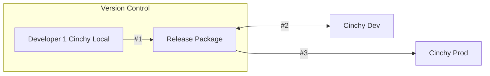
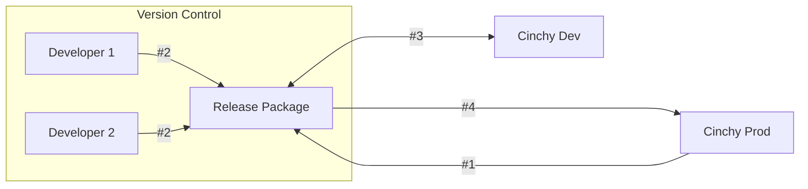
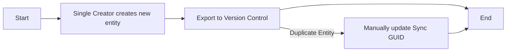

# CinchyDXD 2.0 workflow

## Overview

The CinchyDXD 2.0 workflow depends on four system tables within Cinchy:

1. [**Data Experience Definitions Table**](/guides-for-using-cinchy/builder-guides/cinchydxd/References/data-experience-definitions.md): This is where you define the data experience. This includes tables, queries, views, formatting rules, and user defined functions (UDFs).
1. [**Data Experience Reference Data Table**](/guides-for-using-cinchy/builder-guides/cinchydxd/References/data-experience-reference.md): This table defines data that must move with the data experience for it to function. This includes lookup values and static values that might exist in tables—it typically would not be the physical data itself. It also includes the following items:
   * **Version Number**
   * **Release Binary**
   * **Release Name**
   * **Data Experience**

## Basic workflow 

The basic workflow for using CinchyDXD 2.0 is the following:

1. Define your data references in the **Data Experience Definitions** table. This definition creates a GUID.
1. Create the references to data you want to move with the data experience in the **Data Experience Releases** table.
1. Package the data experience in PowerShell with CinchyDXD.
1. Upload the package to a version control system for further development work.
1. When finished, use CinchyDXD to install the package on the upper environment.

### Example continuous workflow

The diagram below illustrates a sample scenario where a data experience is exported from a production environment for hot fixes from a development team.

1. After packaging the data experience, the experience is uploaded to version control.
1. The development team works on the release package.
1. The release package is then installed to a DEV environment for testing.
1. When ready, install the release package back onto the Prod environment.

### Sync GUID components

The Sync GUID in the origin environment consists of three elements:

1. Data Experience Sync GUID
2. Data Experience GUID
3. Entity GUID

In the origin environment (the export environment of the original data experience), both the Sync GUID and the GUID are identical.

A Sync GUID is created for each entity when it's installed onto a second environment.

### Managing entities 

Cinchy assigns a Sync GUID to each new entity (such as a Domain, Group, or Data Sync Configuration). Stick to these guidelines to avoid conflicts:

1. **Single Creator**: Only one person should create a new entity.
2. **Version Control**: After creating an entity, immediately export it to version control.
3. **Duplicate Entities**: If a duplicate entity is made, manually update the Sync GUID to resolve the conflict.

#### Example

If Developer 1 creates a `Sandbox` Domain and others need it, they should promptly push it to source control. Failing to do so may lead to conflicts if Developer 2 also creates a `Sandbox` Domain.

### Export and install process between instances

If you export data from environment A and install it into environment B, and later plan to export from Instance B, use the original DXD GUID. This GUID can now be found in the **Sync GUID** column under the **Data Experience Definitions** table in Instance B.

### Considerations

When using DXD, you should always consider the following:

- Both the source and target environments must run on the same version of Cinchy. For example, Source Version 5.7, Target Version 5.7.

## Next steps

- [Package the data experience](../cinchydxd/package-the-data-experience.md).
- Review the [Release package](../cinchydxd/release-package.md) page.