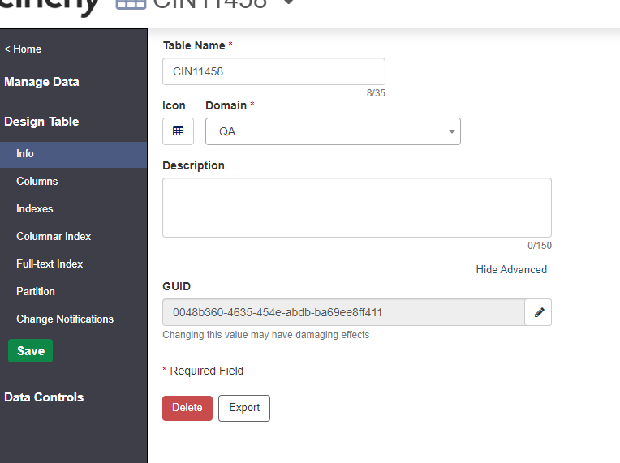

# Table and Column GUIDs

## Overview

A GUID is a globally unique identifier, formatted as a 128-bit text string, that represents a unique identification. Both Cinchy Tables and Columns have a GUID.

This feature is particularly useful when **deploying between Cinchy instances.**

**For example,** in a model deployment, you must have matching GUIDs on your columns in order for them to properly load between environment A and environment B. There might be times when these GUIDs don’t automatically match, however, such as if you manually added a new column to environment B and also manually added it to environment A.

**In this case,** the two columns would have different GUIDs, and the model deployment would fail. With this new feature, however, you can match up conflicting GUIDs to properly load your model.

## 1. Viewing and Editing GUIDs

You have the ability to display and edit these table and column GUIDs within the Design Table screen.

**Table GUIDs** musts be unique to your specified environment.

**Column GUIDs** must be unique to the table.

1. Table GUIDs can be found under **Design Table > Info > GUID** _(Image 1)._
2. Click on the pencil icon to edit the GUID.


GUIDs must adhere to supported formats for Cinchy.

* 32 hexadecimal (base-16) digits.
* Displayed in five groups, separated by hyphens.
* The groups take the form of 8-4-4-4-12 characters, for a total of 36 characters (32 hexadecimal characters and 4 hyphens).

**Example: 123e4567-e89b-12d3-a456-426614174000**



Warning: Changing the value may have damaging effects, proceed with caution.


<figure><figcaption>
Image 1: Table GUID
</figcaption></figure>

3\. Column GUIDs can be found under **Design Table > Columns > GUID** _(Image 2)._

4\. Click on the pencil icon to edit the GUID.


GUIDs must adhere to supported formats for Cinchy.

* 32 hexadecimal (base-16) digits.
* Displayed in five groups, separated by hyphens.
* The groups take the form of 8-4-4-4-12 characters, for a total of 36 characters (32 hexadecimal characters and 4 hyphens).

**Example: 123e4567-e89b-12d3-a456-426614174000**



Warning: Changing the value may have damaging effects, proceed with caution.


<figure><figcaption>
Image 2: Column GUID
</figcaption></figure>
