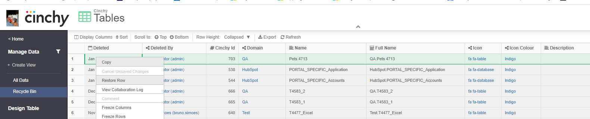

# Restoring tables, columns, and rows

## Overview

This page documents the method of restoring deleted tables, columns, and rows in your Cinchy table.


Remember that you can always **revert a changed or deleted record** to a previous state using the[ Collaboration Log.](https://platform.docs.cinchy.com/guides-for-using-cinchy/user-guides/data-management#6.-collaboration-log)


## Restore a deleted row

To restore a row that has been deleted:

1. In the table where you want to restore the row, navigate to the **Recycle Bin.**
2. Locate the deleted row.
3. Right click anywhere in the row > **Restore Row** _(Image 1)._
4. You should see a "**Restore Successful"** pop-up.

<figure><figcaption>
Image 1: Restoring a Row
</figcaption></figure>

## Restore a deleted or changed column

To restore a column that has been deleted or changed:


Note: You need **insert access** on the **Table table** to complete these steps.



This method will revert the entire table, including any changes made after the column was deleted.


1. Navigate to the **\[Cinchy].\[Tables]** table.
2. Find the row with **the table that has the column you want to restore > right click anywhere in the row > Collaboration Log > Revert to a previous version** _(Image 2)._
3. You should see a "**Revert Successful"** pop-up.

<figure><figcaption>
Image 2: Restoring a Column
</figcaption></figure>

## Restore a deleted table

To restore a table that has been deleted:


Note: You need **insert access** on the **Tables table** to complete these steps.


1. Navigate to the **\[Cinchy].\[Tables]** table.
2. Navigate to the **Recycle Bin.**
3. Find the row with **the table that you want to restore > right click > "Restore Row"** _(Image 3)_
4. You should see a "**Restore Successful"** pop-up.

<figure><figcaption>
Image 2: Restoring a Row
</figcaption></figure>


Make sure the Deleted date is the same, and you don't retrieve previously dropped columns.

