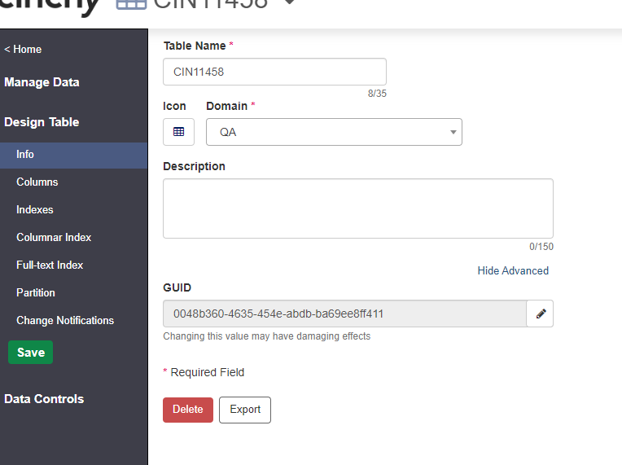
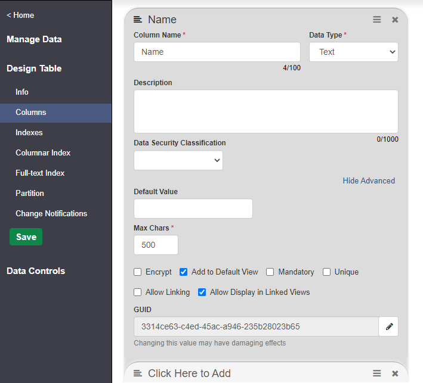

# 5.4 Release Notes


Version 5.4 of the platform was released on January 18th, 2023.



For instructions on how to upgrade to the latest version of Cinchy,[ see here.](../../deployment-guide/upgrade-guides/)


## **New Rich Text Editing Capabilities in Forms**

Customize the appearance of your **Form text** with our new rich text editing capabilities. Enabling this on your text columns will give you access to exciting new formatting options previously unavailable in Forms such as:

* Bold, Italic, Underlined text
* Checklists
* Headers
* Hyperlinks
* etc.

For more information on how to make a visual impact with our new rich text editing capabilities, please review the [documentation here.](../../meta-forms/meta-forms-builders-guides/rich-text-editing-in-forms.md)

## Editable GUIDs

A GUID is a globally unique identifier, formatted as a 128-bit text string, that represents a unique ID. **All Cinchy Tables and Columns have a GUID.**

[You now have the ability to display and edit table and column GUIDs within the Design Table screen.](https://platform.docs.cinchy.com/guides-for-using-cinchy/builder-guides/creating-tables/table-and-column-guids#1.-viewing-and-editing-guids)

This feature is particularly useful when **deploying between Cinchy instances.**

**For example,** in a model deployment, you must have matching GUIDs on your columns in order for them to properly load between environment A and environment B. There might be times when these GUIDs don’t automatically match, however, such as if you manually added a new column to environment B and also manually added it to environment A.

In this case, the two columns would have different GUIDs, and the model deployment would fail. With this new capability, however, you can match up conflicting GUIDs to properly load your model.

<figure><figcaption><p>Table GUID</p></figcaption></figure>

<figure><figcaption><p>Column GUID</p></figcaption></figure>

## **Polling Event Data Sync**

Version 5.4 of the Cinchy platform introduces data polling, which uses the Cinchy Event Listener to **continuously monitor and sync** data entries from your SQL Server or DB2 server into your Cinchy table. This capability makes data polling a much easier, effective, and streamlined process and avoids implementing the complex orchestration logic that was previous necessary to capture frequently changing data.

You can read more about setting up Data Polling [here.](https://cli.docs.cinchy.com/builder-guide/configuring-a-data-sync/supported-data-sources/polling-event)

## BigInt Upgrade Utility

A mandatory database upgrade script was introduced in v5.2 that increased the number of possible Cinchy IDs that can be generated ([read the releases note here](https://platform.docs.cinchy.com/release-notes/release-notes/5.2-release-notes#another-move-toward-infinite-scalability)). To streamline this process further, we have created a utility to deploy the changes. This should save you valuable time and resources when performing the upgrade, even on large databases.

For more information on the utility, [please review the documentation here.](https://platform.docs.cinchy.com/deployment-guide/upgrade-guides/upgrading-cinchy-versions/v5.2+-upgrade-increased-number-of-cinchy-ids-int-to-bigint)

## New Platform Default Timeout

For new environments (or if your setting was previously left blank), we have changed the Cinchy default session timeout from 30 minutes to **7 days**. This will keep you logged in and working without interruptions. You can further change or revert this session timeout value in your appsettings.

In an IIS deployment, you can find the value in your  **CinchySSO > appsettings.json**&#x20;

<pre class="language-json"><code class="lang-json"><strong>“ConfigSettings”: {
</strong>	“AppSettings”: {
		"CinchyAccessTokenLifetime": "7.00:00:00",
</code></pre>

\
In a Kubernetes deployment, you can find the value in your **deployment.json file.**

```json
// The Cinchy session timeout
"cinchy_session_timeout" : "7.00:00:00",
```

## Enhancements

* We have upgraded our application components to **.NET 6.0** to ensure official Microsoft support for another 2 years. [See the documentation here for more on .NET 6.](https://learn.microsoft.com/en-us/dotnet/core/whats-new/dotnet-6)


Becauses of the .NET update, if you are upgrading to **5.4+ on an SQL Server Database** you will need to make a change to your connectionString. Adding **TrustServerCertificate=True** will allow you to bypass the certificate chain during validation.

**In an IIS Deployment** you must update your connectionString in your [Cinchy SSO](https://platform.docs.cinchy.com/deployment-guide/deployment-installation-guides/iis-deployment-platform-installation#4.2-connection-string)[ ](https://platform.docs.cinchy.com/deployment-guide/deployment-installation-guides/iis-deployment-platform-installation#4.2-connection-string)and [Cinchy](https://platform.docs.cinchy.com/deployment-guide/deployment-installation-guides/iis-deployment-platform-installation#5.-update-the-cinchy-appsettings.json) appsettings.

**In a Kubernetes deployment** you must update your connectionString in your [deployment.json.](https://platform.docs.cinchy.com/deployment-guide/upgrade-guides/upgrading-cinchy-versions/kubernetes-upgrades/v5.4-kubernetes#1.2-configuring-to-the-newest-version)


* We have added a **silent refresh** to the Connections experience to keep your session active while you're on the UI and to keep you working without interruptions.
* Real time data sync will now continue to retry if an **"Out of Memory Exception"** is thrown, avoiding unnecessary downtime.
* You now have the ability to choose between Debian or Alpine based Docker images when using a Kubernetes deployment of the Cinchy platform to be able to connect to a **DB2 data source** in Connections.
  * When either [installing](https://platform.docs.cinchy.com/deployment-guide/deployment-installation-guides/kubernetes-deployment-installation) or [upgrading](https://platform.docs.cinchy.com/deployment-guide/upgrade-guides) your platform, you can use the following Docker image tags for the **listener, worker, and connections:**
    * **Alpine: "5.x.x"**
    * **Debian: "5.x.x-debian"**
* You now have the option to **update the default passwords for Grafana and Opensearch** in a Kubernetes deployment by configuring your **deployment.json** file. See here for instructions on updating [Grafana](../../guides-for-using-cinchy/additional-guides/monitoring-and-logging-on-kubernetes/grafana.md#dashboard-query-3) and here for [Opensearch.](../../guides-for-using-cinchy/additional-guides/monitoring-and-logging-on-kubernetes/opensearch-dashboards/#3.-updating-your-opensearch-password)
* We have **increased the average throughput for CDC subscriptions returning the Cinchy ID**, so that it will now be able to process a greater number of events per second. Being able to reliably exceed 1000 events per second, based on the average use case, means that you can leverage the CDC capability for more demanding use cases.
* Prior to this release, the Files API could only handle files up to 100mb. We have now upped the **maximum default file size to 1GB** and have added a configurable property to allow you to set your own upload size should you wish.
  * In an **IIS deployment,** you can find the value in your **Cinchy > appsettings.json**

```json
“ConfigSettings”: {
	“AppSettings”: {
		“MaxRequestBodySize”: 1073741824 // 1g
```

* In a **Kubernetes deployment,** you can find the value in your **deployment.json file.**

```json
// this field defaulted at 1gb, dictates the max file upload size set in the web appsettings.json
"web_max_request_body_size" : 1073741824,
```


Note: When choosing your maximum upload size, keep in mind that very large files may slow down your database if you are using[ local storage.](../../deployment-guide/deployment-installation-guides/kubernetes-deployment-installation/changing-your-file-storage-configuration.md)


## Bug Fixes

* We have fixed an error that occurred when attempting a data sync with **conflicting target and source data types** in link columns, where the error message would read: **Value must be specified from the available options**
* We have fixed an issue that was preventing new Connection jobs from starting when **a previous job got stuck.**
* We have fixed an issue where **data syncs would fail** if your sync key used a **Target Column with a Link Column property** that is different from the Primary Linked Column in the table definition.
* We have fixed a bug that was **impacting write performance** to tables on PostgreSQL with **Data Change Notifications enabled.**
* We have fixed a **"cell entitlements failed"** error on Forms that would occur if a Form column contained a single quote in the column name.
* We have fixed an issue on Forms where adding a **\[Created By] or \[Modified By] field** would return an error.
* The **/healthcheck** no longer redirects to the initialization screen during a Cinchy startup, allowing you to properly hit the endpoint.
