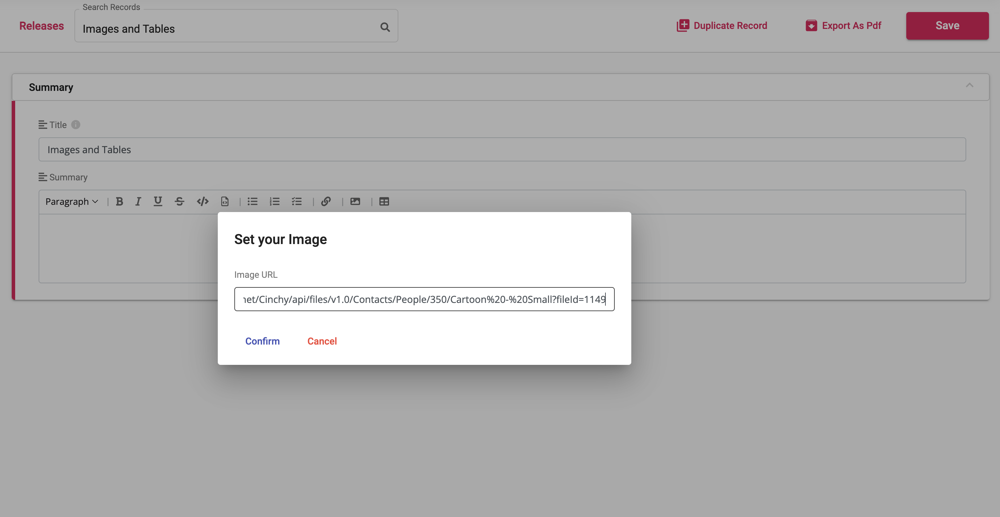
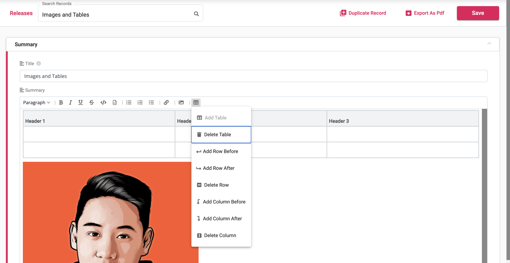
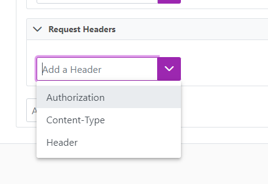
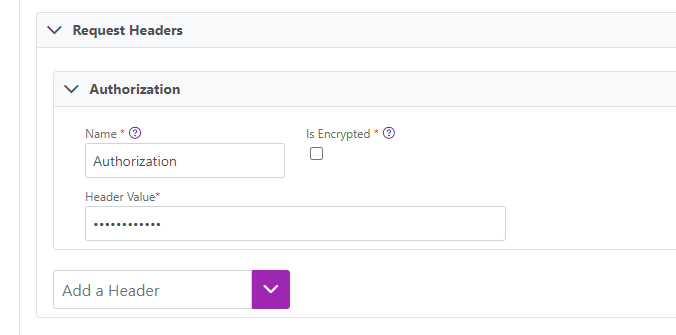
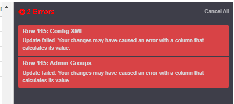

# 5.5 Release Notes


Cinchy version 5.5 was released on February 24, 2023.



For instructions on how to upgrade your platform to the latest version, please review the documentation [here.](https://platform.docs.cinchy.com/upgrade-guide/upgrade-guides/upgrading-cinchy-versions)


## Cinchy Upgrade Utility

The Cinchy Upgrade Utility was previously introduced in v5.2 to facilitate a mandatory INT to BigInt upgrade. This tool will continue to be used in subsequent releases as an easy way to deploy necessary changes to your Cinchy platform.

<mark style="color:red;">**For version 5.5, you must run the Upgrade Utility to fix a row-breaking issue that could be triggered on cells with over 4000 characters,**</mark> where you are unable to update any column in your record.

Please review the [Utility Guide](https://platform.docs.cinchy.com/upgrade-guide/upgrade-guides/upgrading-cinchy-versions/cinchy-upgrade-utility) or [Upgrade Guide](https://platform.docs.cinchy.com/upgrade-guide/upgrade-guides/upgrading-cinchy-versions) for further details.

## New: Personal Access Tokens

You now have the option to use personal access tokens (PATs) in Cinchy, which are alternatives to using passwords for authentication. Similar to [Cinchy Bearer Tokens](https://platform.docs.cinchy.com/api-guide/api-overview/api-authentication#post-bearer-token-request), you can use a Cinchy PAT to call the Cinchy API as your current user, meaning your associated access controls will be honoured as well. Cinchy PATs, however, have an expiration date of up to 1 year. A single user can have up to 5 PATs active at one time.

For information on setting up, configuring, and managing PATs, please [review the documentation here.](https://platform.docs.cinchy.com/guides-for-using-cinchy/user-guides/user-preferences/personal-access-tokens)

<figure><figcaption></figcaption></figure>

## MongoDB

We've added MongoDB to our Connections offering as both a source and target connector.

[MongoDB](https://www.mongodb.com/what-is-mongodb/features) is a scalable, flexible NoSQL document database platform known for its horizontal scaling and load balancing capabilities, which has given application developers an unprecedented level of flexibility and scalability.

Review the following documentation to use this new capability in Cinchy:

- [Setting up a MongoDB Collection (Event Triggered) as a source connector](https://cli.docs.cinchy.com/builder-guide/configuring-a-data-sync/supported-data-sources/mongodb-collection-cinchy-event-triggered)
- [Setting up a MongoDB Collection as a source connector](https://cli.docs.cinchy.com/builder-guide/configuring-a-data-sync/supported-data-sources/mongodb-collection)
- [Setting up MongoDB as a target connector](https://cli.docs.cinchy.com/builder-guide/configuring-a-data-sync/supported-sync-targets/mongodb-collection-column-based)
- [Setting up a MongoDB change stream](https://cli.docs.cinchy.com/builder-guide/subscribing-to-event-streams/supported-stream-sources/mongodb)

## Enhancements

- We're continuing to improve our text editor functionality for forms. You can now **embed tables and images into your text.** We've also made various styling and usability quality of life updates, including the addition of checkbox style lists.

<figure><figcaption>
Add the URL to your image
</figcaption></figure>

<figure><figcaption>
Add or remove columns and rows to your table
</figcaption></figure>

- We've added support for **ephemeral volumes in Connections on a Kubernetes deployment.** Unlike persistent volumes, ephemeral storage is unstructured and the space is shared between all pods running on a node**;** it allows pods to be started and stopped without being limited to the location of persistent volume. Running more than one pod for Connections per availability zone enables you to effectively leverage auto scaling functionality.
- We've updated the Connections experience to enable more use cases. You can now use CDC parameters in Calculated Columns and use the CinchyID in the sync key in real-time syncs.
- Kafka supports cluster encryption and authentication, which can encrypt data-in-transit between your applications and Kafka. **We've added the ability to include this encryption/authentication in the Listener Config when setting up real-time syncs using Kafka.**
  - Using this parameter will specify which protocol will be used for communication between client and server. Cinchy currently supports the following options: Plaintext, SaslPlaintext, or SaslSsl.
    - **Paintext:** Unauthenticated, non-encrypted.
    - **SaslPlaintext:** SASL-based authentication, non-encrypted.
    - **SaslSSL:** SASL-based authentication, TLS-based encryption.
  - [**Review the Listener Config documentation on Kafka here.**](https://cli.docs.cinchy.com/builder-guide/subscribing-to-event-streams/supported-stream-sources/kafka-topic-json)
- We've **improved the implementation of tooltips** such that linked columns display the tables that they link to. Hovering over the _i_ symbol on a linked column will show the linked domain and table in the following format: **Domain - Table**; _ex: HR - Employees._ You can now also see them in the grid view.


In order for the above tooltip improvement to reconcile in your Cinchy environment, you must deploy an up-to-date version of the Forms Data Experience. You can review the installation instructions [here](https://platform.docs.cinchy.com/guides-for-using-cinchy/builder-guides/cinchydxd/reinstalling-the-data-experience) and retrieve the package [here.](https://github.com/cinchy-co/meta-releases/tree/main/Meta-Forms)


- We've introduced a **Retry Configuration** for **REST API sources and targets.** This will automatically retry HTTP Requests on failure based on a defined set of conditions. This capability provides a mechanism to recover from transient errors such as network disruptions or temporary service outages.
  - For more information on using this configuration, **refer to the documentation** [**here for REST sources**](https://cli.docs.cinchy.com/builder-guide/configuring-a-data-sync/supported-data-sources/rest-api#4.-retry-configuration) **and** [**here for REST targets.**](https://cli.docs.cinchy.com/builder-guide/configuring-a-data-sync/supported-sync-targets/rest-api#6.-retry-configuration)
- We've increased the default retention for Prometheus **from 5GB to 50GB** to allow you to store more metric data at a time.
  - This change is automatically reflected in new v5.5 deployments. Customers on previous v5 versions wishing to implement the change are able to rerun the automation script and deploy the new template to reflect the update.
- To make the Forms experience more responsive and process quicker, we've introduced lazy loading of records while searching. Instead of loading and rendering every form record in the search box, which can be a slow process for use cases with millions of records, lazy loading will initially retrieve a limited number of records. These results can then be further optimized by inputting your **Lookup Filter Conditions.**
- We've added the ability to **pass parameters from a REST response into post sync scripts** during both real-time and batch data syncs, allowing you to do more with your REST API data.
  - For an example and instructions on this capability, [**please refer to the documentation here.**](https://cli.docs.cinchy.com/builder-guide/configuring-a-data-sync/supported-sync-targets/rest-api#7.-post-sync-scripts)
- Data changes in Cinchy (CDC) can now be used to **trigger a data sync from a REST API or MongoDB data source** to a specified target. This works as an alternative to RunQuery.
  - For more information, please review the documentation here[ (REST API) ](https://cli.docs.cinchy.com/builder-guide/configuring-a-data-sync/supported-data-sources/rest-api-cinchy-event-triggered)and here [(MongoDB).](https://cli.docs.cinchy.com/builder-guide/configuring-a-data-sync/supported-data-sources/mongodb-collection-cinchy-event-triggered)
- We've added two new functions, JSON_ESCAPE and URL_ESCAPE, which can be used in Connections to escape parameter values when used in constructing the body of a REST API Request or in the URL
- We've added an **Authorization header type** for REST API data syncs in Connections. An authorization request header can be used to provide credentials that authenticate a user with a server, allowing access to a protected resource. Selecting this header defines the **Header Value as a password field.**

<figure><figcaption></figcaption></figure>

<figure><figcaption></figcaption></figure>

## Bug Fixes

- We've solved an issue that was causing Connections to get stuck behind long running jobs despite there being capacity to execute. This fix enables predictable execution behavior without stoppage.
- We've fixed an issue in the MatchEngine where execution was failing in versions of Cinchy above 5.2.
- File sourced data syncs will no longer fail, allowing you to run Connection jobs with uploaded files without the risk of a file not found error when auto scaling is enabled.
- To prevent needlessly exhausting Cinchy IDs, the platform will **no longer continuously retry to update records that have failed to save.** This can sometimes occur when a value causes a calculated field to violate a uniqueness constraint. If the below error appears, you will have to manually update the cell to retry the save.

<figure><figcaption></figcaption></figure>

- We've fixed a bug that was **causing the Connections UI to crash** if you attempted to run a job while there was an empty parameter in the **Info tab** (ex: no name or formula)
- We've fixed a bug that would causes images in Forms to sometimes appear with a label above them, using the image's URL as the label's value.
- We've fixed a bug that was **forcibly terminating authenticated sessions in Grafana**, now allowing you to work without interruptions.
- We've solved an issue where using a form as a **child form with file links** wouldn't render the link thumbnail correctly in the "edit record" view.
- We've fixed a bug that **prevented record updates** when multiple users attempted to update a row in too quick of a succession.
- We've fixed an issue where doing **delta batch syncs with a REST API target** wouldn’t replace the @COLUMN parameter correctly.
- We've fixed a bug in Connections where an **Oracle sync target** would have the wrong tag in the Config XML.
- We've fixed a bug that was causing a **“Listener is running” message to erroneously appear** when the status of the listener was actually set to Disabled.
- We've fixed a bug that was preventing **REST API real-time sync execution errors** from being inserted into the execution errors table.
