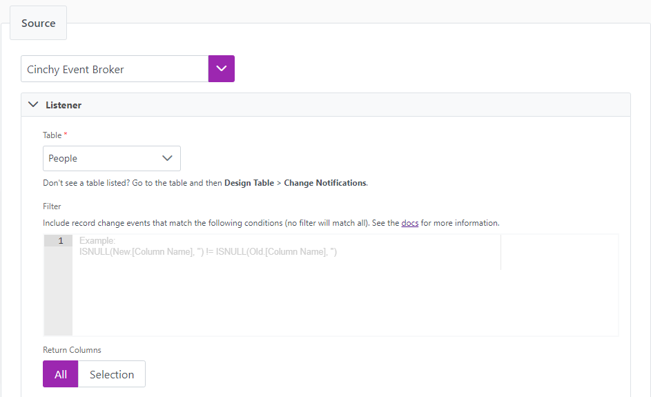

# 5.7 Release Notes


Cinchy version 5.7 was released on XXXX



For instructions on how to upgrade your platform to the latest version, please review the documentation [here.](../../deployment-guide/upgrade-guides/)


## New Capabilities

### **Connections**

#### Test connections

We made it simpler to debug invalid credentials in data syncs by adding a **"Test Connection" button** to the UI for the following sources and destinations:

| Name               | Source | Destination |
| ------------------ | ------ | ----------- |
| Amazon Marketplace | ✅      | 🚫          |
| Binary Files       | ✅      | N/A         |
| Copper             | ✅      | N/A         |
| DB2                | ✅      | ✅           |
| Delimited File     | ✅      | N/A         |
| Dynamics           | ✅      | 🚫          |
| Excel              | ✅      | N/A         |
| Fixed Width File   | ✅      | N/A         |
| Kafka Topic        | 🚫     | ✅           |
| ODBC               | ✅      | N/A         |
| Oracle             | ✅      | ✅           |
| Parquet            | ✅      | N/A         |
| Salesforce Object  | ✅      | ✅           |
| Snowflake          | ✅      | ✅           |
| MS SQL Server      | ✅      | ✅           |

Selecting this button will validate whether your username/password/connection string/etc. are able to connect to your source or destination. If successful, a "Connection Succeeded" popup will appear. If unsuccessful, a "Connection Failed" message will appear, along with the ability to review the associated troubleshooting logs. With this change, you are able to debug access-related data syncs at a more granular level.

<div data-full-width="true">

<figure><figcaption></figcaption></figure>

</div>

<figure><figcaption></figcaption></figure>

<figure><figcaption></figcaption></figure>

#### Listener config integration

As we continue to enhance our Connections Experience offerings, you can now configure your listener for real-time syncs directly in the UI without having to navigate to a separate table. For any event triggered sync source, **(CDC, REST API, Kafka Topic, MongoDB Event, Polling Event, Salesforce Platform Event, and Salesforce Push Topic)**, there is now the option to input your configurations directly from the Source tab in the Connections Experience. Any configuration you populate via the UI will be automatically reflected back into the Listener Config table of your platform.

You are able to set the:

* Topic JSON
* Connections Attributes
* Auto Offset Reset
* Listener Status (Enabled/Disabled)

<figure><figcaption></figcaption></figure>

Information on the parameters and configurations for the above settings can be found [here](../../data-syncs/supported-real-time-sync-stream-sources/the-listener-configuration-table.md) and [here.](../../data-syncs/supported-real-time-sync-stream-sources/)

For ease of use, we also added help tips to the UI, as well as examples where necessary.


If there is more than one listener associated with your data sync, you still need to configure it via the Listener Configuration table.


#### New Source: Oracle Polling Connector

**We added Oracle** as a new database type for Polling Events in Connections. Data Polling is a source option first featured in Cinchy v5.4 which uses the Cinchy Event Listener to continuously monitor and sync data entries from your Oracle, SQL Server, or DB2 server into your Cinchy table. This capability makes data polling a much easier, effective, and streamlined process and avoids implementing the complex orchestration logic that was previous necessary.

#### Source filter additions

**For REST API, SOAP 1.2, Kafka Topic, Platform Event, and Parquet sources**, we added a new [**"Conditional" option for source filters**](../../data-syncs/building-data-syncs/advanced-settings/filters.md#1.-source-filters) in the Connections UI. Similarly to how the "Conditional Changed Record Behaviour" capability, works, once selected you will be able to define the conditions upon which data is pulled into your source via the filter. After data is pulled from the source, new conditional UI filters down the set of returned records to ones that match the defined conditions.

<figure><figcaption></figcaption></figure>

#### Cinchy Secrets table

The Cinchy platform now comes with a new way to store secrets — [the Cinchy Secrets Table](../../guides-for-using-cinchy/additional-guides/cinchy-secrets-manager.md). Adhering to Cinchy’s Universal Access Controls, you can use this table as a key vault (such as Azure Key Vault or AWS Secrets Manager) to store sensitive data only accessible to the users or user groups that you give access to.

<figure><figcaption></figcaption></figure>

You can use secrets stored in this table [anywhere a regular variable can go](../../data-syncs/building-data-syncs/advanced-settings/variables.md) when configuring data syncs, including but not limited to:

* **As part of a connection string;**
* **Within a REST Header, URL, or Body;**
* **As an Access Key ID.**

You can also use it in a Listener Configuration.

Additionally, we've implemented a new [API endpoint](../../api-guide/api-overview/) for the retrieval of your secrets. Using the below endpoint, fill in your \<base-url>, \<secret-name>, and the \<domain-name> to retrieve the referenced secret.

This endpoint works with Cinchy’s [Personal Access Token](../../guides-for-using-cinchy/user-guides/user-preferences/personal-access-tokens.md) capability, as well as Access Tokens retrieved from your IDP.

**Blank Example:**

```
<base-url>/api/v1.0/secrets-manager/secret?secretName=<secret-name>&domain=<domain-name>
```

**Populated Example:**

```
Cinchy.net/api/v1.0/secrets-manager/secret?secretName=<ExampleSecret>&domain=<Sandbox>
```

The API will return an object in the below format:

```
{
    "secretValue": "password123"
}
```

#### Polling listener optimization

To improve your Connections experience, we made various optimizations to our Polling Event Listener.

* We added a new configurable property, `DataPollingConcurrencyIndex`, to the Data Polling Event Listener. This property allows only a certain number of threads to run queries against the source database, which works to reduce the load against the database. The default number of threads is set to 12. To configure this property, navigate to your **appSettings.json** deployment file **> "DataPollingConcurrencyIndex": \<numberOfThreads>**
* We added a new configurable property, `QueueWriteConcurrencyIndex`, to the Data Polling Event Listener. This property allows only a certain number of threads to be concurrently sending messages to the queue. This works to provide a more consistent batching by the worker and reduce your batching errors. run queries against the source database, which works to reduce the load against the database. The default number of threads is set to 12. To configure this property, navigate to your **appSettings.json** deployment file **> "QueueWriteConcurrencyIndex": \<numberOfThreads>.** Note that this index is shared across all listener configs, meaning that if it's set to 1 only one listener config will be pushing the messages to the queue at a single moment in time.
* We added a new mandatory property, `CursorConfiguration.CursorColumnDataType`, to the Listener Topic for the Data Polling Event. This change was made in tandem with an update that ensure that the database query always moved the offset, regardless of if the query returned the records or not—this helps to ensure that the performance of the source database isn't being weighed down by constantly running heavy queries on a wide range of records when the queries returned no data. This value of this mandatory property must match the column type of the source database system for proper casting of parameters.
* We added a new configurable property, `CursorConfiguration.Distinct`, to the Listener Topic for the Data Polling Event. This property is a true/false Boolean type that, when set to true, applies a distinct clause on your query to avoid any duplicate records.

<pre class="language-json" data-overflow="wrap"><code class="lang-json"><strong>// App Settings JSON Example
</strong><strong>// Example of the new configurable propeties: DataPollingConcurrencyIndex (set to "1") and QueueWriteConcurrencyIndex (set to "1")
</strong>"AppSettings": {
    "GetNewListenerConfigsInterval": "",
    "StateFileWriteDelaySeconds": "",
    "KafkaClientConfig": {
      "BootstrapServers": ""
    },
    "KafkaRealtimeDatasyncTopic": "",
    "KafkaJobCancellationTopic": "",
    "DataPollingConcurrencyIndex":  1,
    "QueueWriteConcurrencyIndex":  1
  }
</code></pre>


```json
// Listener Config Topic Example
// Example of the new mandatory CursorColumnDataType property, which below is set to "int", and "Distinct", below set to "true".
{
   "CursorConfiguration": {
       "FromClause": "",
       "CursorColumn": "",
       "BatchSize": "",
       "FilterCondition": "",
       "Columns": [],
            "Distinct": "true"
            "CursorColumnDataType" : "int"
   },
        "Delay": ""
}
```


## Enhancements

### Connections

We made various enhancements to the Connections Experience which should help to simplify and streamline your ability to create and maintain data synchronizations across the platform. Examples of these changes can be found in our [Data Sync documentation.](../../data-syncs/)

#### UI Changes

Connections has the following UI changes:

* Converting drop-down menus to radio buttons for the following:
  * **Sync Strategy**
  * **Source Schema Data Types**
  * **Source Schema "Add Column"**
* Increasing the width of the source, destination, and connections drop-down menus to prevent visibility losses on some screens.
* Improvement to the organization of file based source fields.
* Removing the following fields:
  * **Source > Cinchy Table > Model**
  * **Info > Version**
* **Order of Operations changes,** including:
  * Moving the **"Permissions"** step into the **"Info"** tab.
* **Verbiage changes,** including:
  * Changing the name of the **Sync Behaviour"** tab to **Sync Actions"**.
  * Changing the term **Parameters** to **Variables**.
  * Changing **"Sync Pattern"** to **Sync Strategy** in the Sync Behaviour (now Sync Actions) tab.
  * Changing **Column Mappings** to **Mappings** in the Destination tab.
  * Changing **Access Token** to **API Key** in the Copper Source to match the language presented in Copper's own documentation.
  * Aligning file-based connector language across all sources.
  * Adding descriptive text to various sections to help better guide you through the data sync. configuration, including sections such as Mapping, Schema, and Sync Behaviour.
  * Various other verbiage changes throughout the UI.
* **Organization changes**, including:
  * Grouping Sources by type (Batch and Event).
  * Sorting all connections alphabetically.

#### Connections Destination simplification

To speed up the creation of data syncs, We've simplified the process of creating the destination step of a sync by now auto populating the destination as Cinchy Table when choosing any Source that isn't Cinchy.

#### Unique identifiers for saved connections

We now support unique endpoints for all saved connections to make sharing and collaborating on connections easier. Connections now have a unique URL that you can share with other platform users and link them directly to the saved configuration.

#### Load Metadata simplification

We streamlined the **Load Metadata** sources and destinations to provide you with a better user experience. They now have the following changes:

* The **Load Metadata** modal no longer displays when selecting an applicable source or destination.
* The **Load Metadata** button isn't available until the parameters in the **Connection** section are filled.
* The **Load Metadata** button now connects you directly to the metadata columns without displaying an interstitial modal.
* Under the **Schema** section, all columns are now collapsed by default. Manually added columns still default to an expanded view.

#### New UI for listener configs

To help make [real-time syncs easier](../../data-syncs/building-data-syncs/real-time-sync-example.md), Cinchy Event Broker now has a **Listener** section to help create your topic JSON for listener configs. This addition removes the extra step of manually setting up your topic JSON in the **Listener Config** table. For more information on topic JSON fields, see the [Cinchy Broker Event source page](../../data-syncs/supported-data-sync-sources/cinchy-event-broker-cdc/).

<figure><figcaption></figcaption></figure>

#### Log outputs

To help simplify and streamline the Connections experience, you are now able to view the output for each job by clicking on the **Output** button located in the **Jobs** tab of the UI after you run a sync.

<figure><figcaption></figcaption></figure>

This links to the Execution Log table with a filter set for your specific sync, which can help you reach your execution related data quicker and easier than before.

<figure><figcaption></figcaption></figure>

#### Log full REST Target HTTP response

We now log the full REST Target HTTP response in the data sync Execution Errors table to provide you with more detailed information about your job. This replaces the original log that only contained the HTTP response status code.

#### Forms action bar

To improve the user experience and make interacting with forms easier, we made the Forms action bar always visible when you scroll through a form.


### Platform

#### IdentityServer4 to IdentityServer6 upgrade

We upgraded our IDP **from IdentityServer4 to IdentityServer6** to ensure we're maintaining the highest standard of security for your platform.

#### Add Execute function to UDF extensions

We added `execute`, a new method for UDF extensions. This new query call returns a `queryResult` object that contains additional information about your result. For more information, see the [Cinchy User Defined Functions page](../../cql/the-basics-of-cql/cinchy-supported-functions/cinchy-user-defined-functions-udfs/).

#### Expand platform support for DXD

We added additional system columns to extend the number of core Cinchy objects that can be managed through [DXD](../../guides-for-using-cinchy/builder-guides/cinchydxd-utility/) 1.7 and higher.

The newly supported Cinchy objects are:

* Views (Data Browser)
* Listener Config
* Secrets
* Pre-install Scripts
* Post-install Scripts
* Webhooks

#### mTLS support

We implemented Istio mTLS support to ensure secure/TLS in-cluster communication of Cinchy components.

## Bugs

### Platform

* We fixed a bug in the Cinchy Upgrade Utility that was causing **the use of the -c flag**, which is meant to delete extra metadata created on the database, to instead run (or rerun) the entire upgrade process.
* We fixed a bug that was stripping query parameters from Relative URLs if they were being used as the Application URL of the applets. In the below screenshot, the bug would have stripped out the "q=1" parameter, leaving only an Absolute URL in lieu of a Relative one.
* We fixed an issue with the behaviour of cached calculated columns when using multi-select data types (Link, Choice, and Hierarchy) with **Change Approval** enabled. These data types should now work as expected.

<figure><figcaption></figcaption></figure>

### Connections

* We fixed a bug where the UUID/ObjectId in a MongoDB Change Stream Sourced data sync wasn't being serialized into text format. If you have any MongoDB Stream Sourced syncs currently utilizing the UUID/ObjectId, **you may need to adjust accordingly when referencing the columns with those data types.**

```json
// Previous UUID/ObjectIDs would have been serialized as the below:
{
  "_id": ObjectId('644054f5f88104157fa9428e'),
  "uuid": UUID('ca8a3df8-b029-43ed-a691-634f7f0605f6')
}

// They will now serialize into text format like this:
{
  "_id": "644054f5f88104157fa9428e",
  "uuid": "ca8a3df8-b029-43ed-a691-634f7f0605f6"
}
```

* We fixed a bug where setting a user’s time zone to UTC (Coordinated Universal Time) would result in no data being returned in any tables.
* We fixed a bug where the Sync GUID of Saved Queries transferred over via DXD would null out.
* We fixed a bug affecting the MongoDB Event Listener wherein the “auto offset reset” functionality would not work as anticipated when set to **earliest**.
* We fixed a bug where failed jobs would return errors for logs that haven't yet been created. Log files now correctly search for only the relevant logs for the failed job.\\
* We fixed an issue in the data configuration table where the `IF` field for the **Delimited File > Conditional Calculated Column** wasn't displaying correctly.
* We resolved an issue where using multiple parameters when running a data sync using the CLI could result in parsing and execution errors.
* We fixed a bug preventing calculated columns from working in MongoDB targets for data syncs.
* We fixed a bug where users were prompted to restore unsaved changes for a new connection when no configuration changes to a data sync were made.
* We fixed a bug that was causing the platform to fail upon initializing when a System User had been added to any user group (such as the Connections or Admin groups).
* We fixed a bug where passing an encrypted value to a variable used in a field encrypted by the connections UI would cause the sync to fail. You can now use variables with either encrypted or plaintext values.
* We fixed a bug where using the "Delta" sync strategy led to duplicating existing records in some destinations before inserting the new rows of data.

### Meta-Forms

* We fixed a bug where child record tables within a form would display data differently when exported to a PDF.
* We fixed an issue where the first load of an applet wouldn't render sections that require Cinchy data until you refreshed the page.

#### MongoDB update

We continue to provide optimization updates to our Connections capabilities. v5.7 of the Cinchy platform has the following updates for the MongoDB Event Stream:

* A new configurable property, ‘QueueWriteConcurrencyIndex’, to the MongoDB Event Listener. This property allows only a certain number of threads to be concurrently sending messages to the queue. This works to provide a more consistent batching by the worker and reduce your batching errors. run queries against the source database, which works to reduce the load against the database. The default number of threads is set to 12. To configure this property, navigate to the appSettings.json > "QueueWriteConcurrencyIndex": \<numberOfThreads>. Note that this index is shared across all listener configs, meaning that if it's set to 1 - only one listener config will be pushing the messages to the queue at a single moment in time.
* We also added a new optional property to the MongoDB Listener Topic, 'changeStreamSettings.batchsize’, that's a configurable way to set your own batch size on the MongoDB Change Stream Listener.

```json
// Example of the listener topic
{
  "database": "",
  "collection": "",
  "changeStreamSettings": {
    "pipelineStages": [],
    "batchSize": "1000"
  }
}
```
