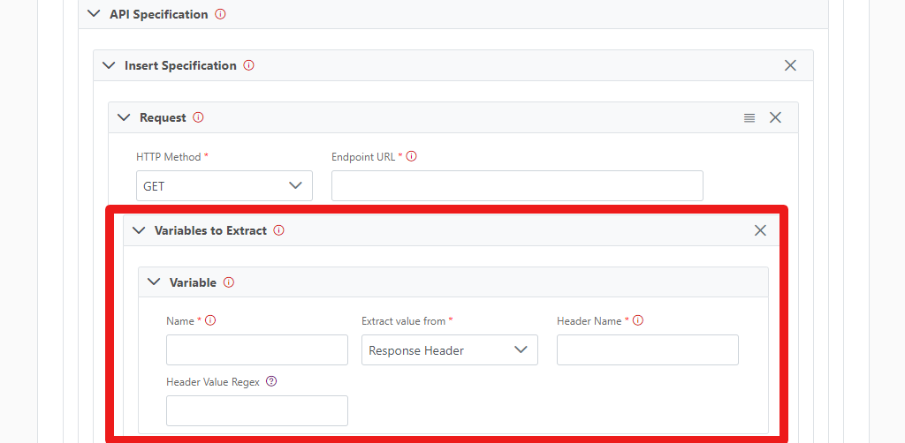
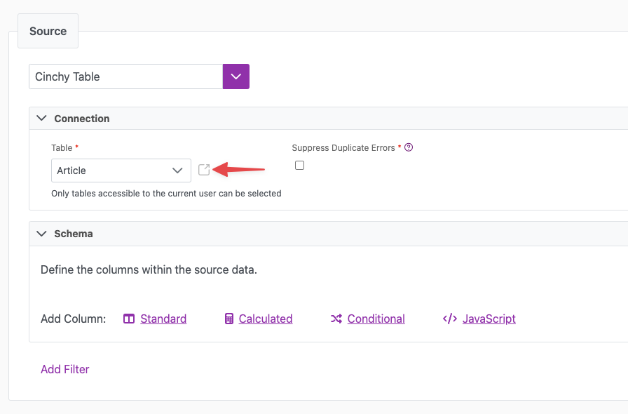
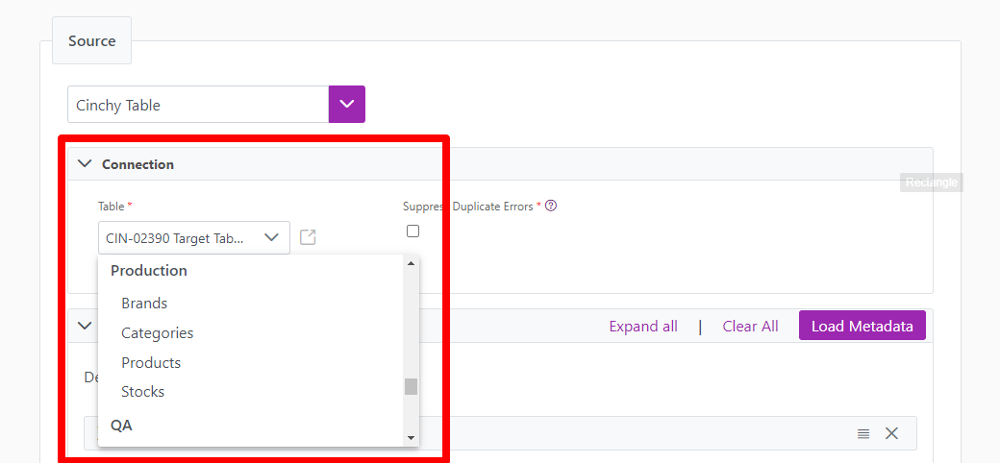
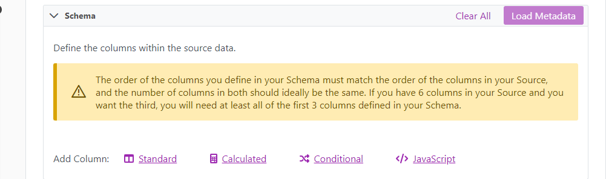

# 5.8 Release Notes

 Cinchy version 5.8 was released on October 27, 2023 



For instructions on how to upgrade your platform to the latest version, please
review the documentation [here.](../../upgrade-guide/upgrade-guides/)



## 5.8 Upgrade guides

Select the links below to see the relevant upgrade guide and release notes.

- [Kubernetes 5.8 Upgrade Guide](../../upgrade-guide/upgrade-guides/kubernetes-upgrades/5.8-kubernetes.md)
- [IIS 5.8 Upgrade Guide](../../upgrade-guide/upgrade-guides/iis-upgrades/v5.8-iis.md)

## New Capabilities

### New event-based Source - SOAP API (CDC Triggered)

Cinchy now supports a new Cinchy event-triggered source: SOAP API. This new
feature initiates a SOAP call based on Change Data Capture (CDC) events
occurring in Cinchy. The SOAP response then serves as the source for the sync
and can be mapped to any destination. 

For more information, see the [SOAP 1.2 (Cinchy Event Triggered)](../../data-syncs/supported-data-sync-sources/soap-cdc.md) page.

## Enhancements

### Platform

#### Updated POST endpoint for Saved Queries

The POST endpoint for Saved Queries now automatically serializes hierarchical
JSON to text when the content-type is `application/json`. This update now
supports values that are objects or arrays. This eliminates the need for manual
serialization and makes it easier for developers to work with Saved Queries.

#### Extract header values in REST API responses

You can now pull specific data from REST API response headers using .NET regex
capture groups. This feature gives you more control and flexibility in
collecting the data you need when using REST API destinations. For more
information, see the
[REST API destination](../../data-syncs/supported-data-sync-destinations/rest-api.md)
page.

### Connections

#### Improved Header Row Behavior in delimited files

We improved the user experience for header row settings for delimited files. The following improvements have been added.

- **Use Header Row Checkbox**: Controls visibility of column names and **Load Metadata** button.
- **Schema Columns Warning**: Informs users about column order when header row is disabled.
- **Modal Warning**: Explains schema column reset when disabling header row.
- **Header Record Row Number**: Specifies row to use as header.

#### Added Links to Open Cinchy Tables and Queries in UI

We added clickable links next to Cinchy Tables and Queries referenced in the UI. These links directly open the respective table or query, making navigation more seamless.

#### Drop-down menu for Domain entities

- You can now use drop-down menus for selecting Cinchy tables and queries for
  both Cinchy sources and destinations. This feature replaces the previous
  method, where users had to manually type in their selections.

#### Warning added to Schema section for specific Sources and Destinations

- We added a warning to the Schema sections of multiple Sources to mitigate
  issues due to mismatched column order. This warns users that the column order
  in the schema must match the source/destination configuration. The changes
  affect the following data sources:

- LDAP
- Excel
- Binary
- Fixed Width
- Cinchy Query

#### Addition of Listener section in triggered Sources for MongoDB Collection (Cinchy Event Triggered) and REST API (Cinchy Event Triggered) Sources

- We added a Listener section to the MongoDB Collection (Cinchy Event Triggered)
  and REST API (Cinchy Event Triggered) Sources. You can now manage the event
  trigger within the Connections UI. This reduces the complexity of managing the
  Listener Config table.

#### DataPollingConcurrencyIndex improvements

We improved the implementation of `DataPollingConcurrencyIndex`. We also
added additional logging in the Data Polling Listener to enhance monitoring.

#### Connections - JSON content type for text columns

When configuring a connection source with text columns, it's possible to specify a JSON content type. This instructs the system to interpret the contents as a JSON object and pass it through as such. This is useful when the target (such as Kafka) supports and expects a JSON object for a specific target column. When setting this option, the value should always be valid JSON.

Alternatively, the original, default behaviour of treating text columns as plaintext is unchanged. As plaintext, the contents of the column will be passed through as a string, even if it could be interpreted as JSON.

## Bugs

### Platform

* We modified the Data Polling mechanism to enhance the reliability of message delivery to Kafka.
* We fixed a bug in CQL on PostgreSQL that caused the `DATEADD` function to truncate input dates down to `DAY` precision. Now, you can expect more accurate date manipulations without losing finer time details.
* We fixed an issue where the UI failed to display Batch Data Sync results and instead showed a generic exception message. The jobs tab in the UI now opens without any API failure appearing in the browser's network console.
* We resolved an issue that caused large batch delta syncs to fail in Cinchy.
* We fixed an issue where Cinchy CDC Delete events weren't sent to the destination using Delta. For example, **Deletes** and **Approved Deletes** now successfully insert records into Kafka when deleted from a Cinchy table.
* We fixed the issue of concurrent updates failing due to a Primary Key (PK) violation on the History table by adding a retry mechanism. This fix aims to make Cinchy more robust when making concurrent updates.
* We resolved an issue during where the Cinchy destination would still be queried during a delta sync.
* We fixed an issue with data syncs that would fail on executed queries that returned large numbers of records on Cinchy Table destinations.
* We resolved issues with parameter resolution in Rest API authentication requests.
  
### Connections

* We resolved an issue where the **Load Metadata** button was failing to connect to DB2 databases when fetching schema information.
* We fixed an issue where the Mapping UI would disappear in the Destination Section for Cinchy Event Broker to MongoDB Collection syncs, where **Sync Actions** were set to **Delta**.
* We fixed an issue where system columns like **Created By**, **Created**, **Modified By**, **Modified**, **Deleted**, and **Deleted By** weren't appearing in the topic columns dropdown in the Listener UI.
* We fixed a bug where the model loader failed to update when you added a description to a calculated column. The table now saves correctly when making changes to calculated columns.
* We fixed an issue that prevented table selection from the drop-down in Cinchy Event Broker's listener configuration.
* We resolved an issue where the `Lookup()` function in the **Filter** field for Cinchy Tables wasn't behaving as expected.
* We restored the default timeout setting for `HttpClient` to over 100 seconds.

